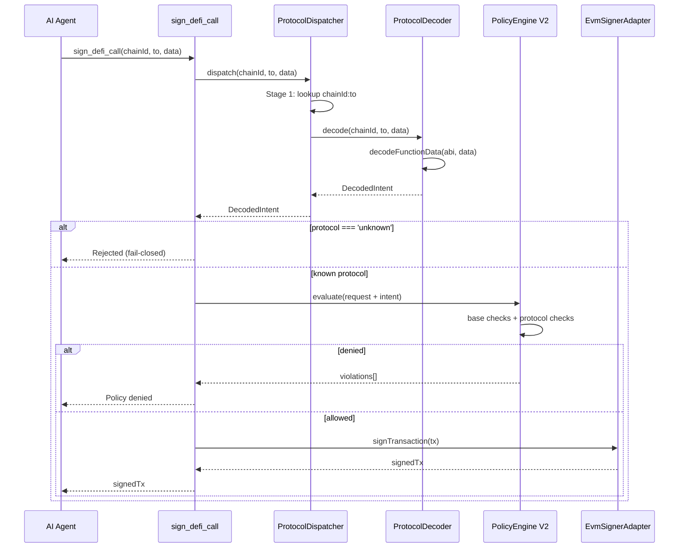
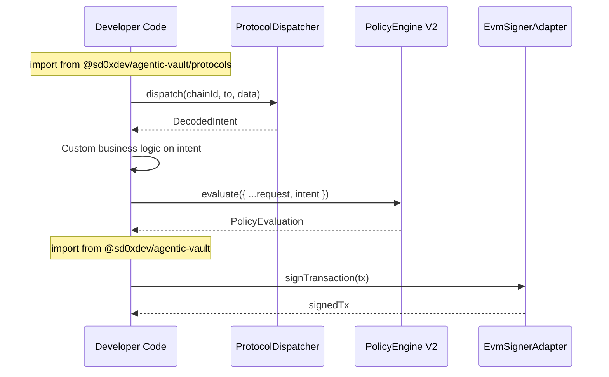

# DeFi Protocol Integration — Technical Specification

> Based on [Feasibility Study](./0-feasibility-study.md) — Solution C (Hybrid: viem-native wallet + external DeFi router)
> Architecture updated per interface-agnostic brainstorm (2026-02-13)

## 1. Overview

| Field | Value |
| --- | --- |
| Feature | Calldata-aware DeFi signing with protocol-level policy enforcement |
| Scope | Protocol decoder framework, Policy V2, `sign_defi_call` MCP tool, `sign_swap` upgrade |
| Protocols | ERC-20, Uniswap V3 (SwapRouter02), Aave V3 (Pool) |
| Dependencies | Zero new runtime dependencies (viem-native) |
| Core impact | `src/core/` unchanged |

### 1.1 Consumer Patterns

The protocol decoder and policy engine are **interface-agnostic** — they can be consumed via multiple surface areas:

| Consumer | Import Path | Interface | What They Get |
| --- | --- | --- | --- |
| Developer (programmatic) | `@sd0xdev/agentic-vault/protocols` | TypeScript SDK | Dispatcher, PolicyEngine, DecodedIntent — no MCP SDK pulled |
| AI Agent (MCP) | MCP `sign_defi_call` / `sign_swap` | MCP transport | Full decode+policy+sign pipeline |
| Claude Code (skills) | Skills → MCP tools | Skill markdown | Governance-consistent signing |
| Backend service | `./protocols` + `.` (signer) | TypeScript SDK | Custom orchestration without MCP |

### 1.2 Package Subpath Exports

```json
{
  ".":           { "types": "./dist/index.d.ts",           "import": "./dist/index.js" },
  "./protocols": { "types": "./dist/protocols/index.d.ts", "import": "./dist/protocols/index.js" },
  "./agentic":   { "types": "./dist/agentic/index.d.ts",   "import": "./dist/agentic/index.js" }
}
```

| Subpath | Contents | MCP dependency |
| --- | --- | --- |
| `.` | Core signing (SigningProvider, EvmSignerAdapter, factory) + type-only re-exports of PolicyConfig/PolicyRequest/PolicyEvaluation/AuditEntry (backward compat, deprecated) | No |
| `./protocols` | Protocol decoder, dispatcher, PolicyEngine V2 (canonical path for policy types) | No |
| `./agentic` | MCP server, CLI, audit logger | Yes |

> **Backward compat note**: Current `src/index.ts` re-exports `PolicyConfig`, `PolicyRequest`, `PolicyEvaluation`, and `AuditEntry` as type-only. These are preserved in v0.1.x for backward compat but deprecated — consumers should migrate to `@sd0xdev/agentic-vault/protocols`.

## 2. Architecture

### 2.1 Layer Diagram

```
┌──────────────────────────────────────────────────────────────┐
│               Layer 3: Interface Layer (src/agentic/)         │
│  sign_swap (upgraded) │ sign_defi_call (new) │ sign_permit   │
│  Audit Logger │ CLI │ MCP Server                             │
└──────────┬────────────┴──────────┬───────────┴───────────────┘
           │                       │
     ┌─────▼───────────────────────▼───────┐
     │     Layer 2: Protocol Logic          │  src/protocols/
     │     ProtocolDispatcher               │
     │     dispatch(chainId, to, data)      │
     │         → DecodedIntent              │
     └─────┬──────┬──────┬──────┬──────────┘
           │      │      │      │
    ┌──────▼┐ ┌───▼──┐ ┌─▼───┐ ┌▼────────┐
    │ERC-20 │ │Uni V3│ │Aave │ │ Unknown  │
    │decoder│ │decode│ │ V3  │ │→ REJECT  │
    └──────┬┘ └───┬──┘ └─┬───┘ └─────────┘
           │      │      │
     ┌─────▼──────▼──────▼─────────────────┐
     │     PolicyEngine V2                  │  src/protocols/policy/
     │     evaluate(request, intent?)       │
     │     → base checks + protocol checks │
     └──────────────┬──────────────────────┘
                    │
     ┌──────────────▼──────────────────────┐
     │  Layer 1: Core Signing (unchanged)   │  src/core/
     │  SigningProvider → EvmSignerAdapter   │
     └─────────────────────────────────────┘
```

### 2.2 File Structure (Target State)

> `src/protocols/` does not exist yet — created in Phase 1 of the migration plan (section 9).

```
src/
├── core/                         # Layer 1: Signing (unchanged)
│   ├── signing-provider.ts
│   └── evm-signer-adapter.ts
├── protocols/                    # Layer 2: Protocol logic (NEW location)
│   ├── index.ts                  # Public entrypoint for ./protocols subpath
│   ├── types.ts                  # DecodedIntent, ProtocolDecoder interfaces
│   ├── registry.ts               # Contract registry (chainId+address → protocol)
│   ├── dispatcher.ts             # dispatch(chainId, to, data) → DecodedIntent
│   ├── decoders/
│   │   ├── erc20.ts              # ERC-20 ABI + decoder
│   │   ├── uniswap-v3.ts         # Uniswap V3 SwapRouter02 ABI + decoder
│   │   └── aave-v3.ts            # Aave V3 Pool ABI + decoder
│   └── policy/
│       ├── types.ts              # PolicyConfigV2, PolicyRequestV2, ProtocolPolicyEvaluator
│       ├── engine.ts             # PolicyEngine (V1 evolved to V2 in place)
│       └── evaluators/
│           ├── erc20.ts          # ERC-20 policy (allowance cap, spender allowlist)
│           ├── uniswap-v3.ts     # Uniswap policy (token pair, slippage, recipient)
│           └── aave-v3.ts        # Aave policy (reserve allowlist, rate mode, amount)
├── provider/                     # Provider factory (unchanged)
├── providers/                    # Provider implementations (unchanged)
├── agentic/                      # Layer 3: Interface layer
│   ├── audit/                    # Audit logger (MCP governance)
│   ├── policy/                   # Re-export bridge (deprecated → use ./protocols)
│   ├── mcp/
│   │   ├── server.ts             # Injects default ProtocolDispatcher
│   │   └── tools/
│   │       ├── shared.ts         # ToolContext with optional dispatcher
│   │       ├── sign-defi-call.ts # New: generic DeFi signing with decoder
│   │       ├── sign-swap.ts      # Upgraded: routes through decoder pipeline
│   │       └── ...               # Existing tools unchanged
│   ├── cli.ts
│   └── index.ts                  # Re-exports PolicyEngine + protocol types
└── index.ts                      # Root exports (core + provider)
```

### 2.3 Trust Boundary

| Module | Allowed Imports | Prohibited |
| --- | --- | --- |
| `src/protocols/**` | `viem`, internal protocol modules, `src/core/**` (direct) | `@modelcontextprotocol/*`, `src/agentic/**` |
| `src/agentic/**` | `src/index.js` (root) + `src/protocols/index.js` (via relative path) | Direct `src/core/**`, `src/providers/**` |
| `src/core/**` | `viem`, internal core modules | `src/agentic/**`, `src/protocols/**` |

The trust boundary test (`test/unit/agentic/trust-boundary.test.ts`) is updated with two allowed import targets (variable depth):

```typescript
const ALLOWED_CROSS_BOUNDARY = [
  /from ['"](?:\.\.\/)+index\.js['"]/, // root public API (any depth)
  /from ['"](?:\.\.\/)+protocols\/index\.js['"]/, // protocols public API (any depth)
];
```

Import asymmetry is intentional:
- `src/protocols/` is a peer domain module — imports from `src/core/` and `viem` directly (no agentic trust-boundary restriction, but still has layered import constraints per the table above)
- `src/agentic/` is the outer interface boundary — imports only through public entrypoints (`index.js`, `protocols/index.js`)

### 2.4 Backward Compatibility Bridge

Existing consumers import `PolicyEngine` from `@sd0xdev/agentic-vault/agentic`. The policy engine moves to `src/protocols/policy/`, so `src/agentic/index.ts` re-exports it:

```typescript
// src/agentic/index.ts — compatibility bridge
// @deprecated Use @sd0xdev/agentic-vault/protocols instead
export { PolicyEngine } from '../protocols/policy/engine.js';
export type { PolicyConfig, PolicyRequest, PolicyEvaluation } from '../protocols/policy/types.js';
```

This bridge will be removed in a future version. The canonical import path is `@sd0xdev/agentic-vault/protocols`.

## 3. Type Definitions

### 3.1 DecodedIntent

```typescript
// src/protocols/types.ts

import type { Address, Hex } from 'viem';

// -- Base fields shared by all decoded intents --
interface IntentBase {
  chainId: number;
  to: Address;
  selector: Hex;
}

// -- ERC-20 --
interface Erc20ApproveIntent extends IntentBase {
  protocol: 'erc20';
  action: 'approve';
  args: { spender: Address; amount: bigint };
}

interface Erc20TransferIntent extends IntentBase {
  protocol: 'erc20';
  action: 'transfer';
  args: { to: Address; amount: bigint };
}

// -- Uniswap V3 --
interface UniswapV3ExactInputSingleIntent extends IntentBase {
  protocol: 'uniswap_v3';
  action: 'exactInputSingle';
  args: {
    tokenIn: Address;
    tokenOut: Address;
    fee: number;
    recipient: Address;
    amountIn: bigint;
    amountOutMinimum: bigint;
    sqrtPriceLimitX96: bigint;
  };
}

// -- Aave V3 --
interface AaveV3SupplyIntent extends IntentBase {
  protocol: 'aave_v3';
  action: 'supply';
  args: { asset: Address; amount: bigint; onBehalfOf: Address; referralCode: number };
}

interface AaveV3BorrowIntent extends IntentBase {
  protocol: 'aave_v3';
  action: 'borrow';
  args: {
    asset: Address; amount: bigint; interestRateMode: bigint;
    referralCode: number; onBehalfOf: Address;
  };
}

interface AaveV3RepayIntent extends IntentBase {
  protocol: 'aave_v3';
  action: 'repay';
  args: { asset: Address; amount: bigint; interestRateMode: bigint; onBehalfOf: Address };
}

interface AaveV3WithdrawIntent extends IntentBase {
  protocol: 'aave_v3';
  action: 'withdraw';
  args: { asset: Address; amount: bigint; to: Address };
}

// -- Unknown (always rejected) --
interface UnknownIntent {
  protocol: 'unknown';
  chainId: number;
  to: Address;
  selector?: Hex;
  rawData: Hex;
  reason: string;
}

// -- Discriminated union --
export type DecodedIntent =
  | Erc20ApproveIntent
  | Erc20TransferIntent
  | UniswapV3ExactInputSingleIntent
  | AaveV3SupplyIntent
  | AaveV3BorrowIntent
  | AaveV3RepayIntent
  | AaveV3WithdrawIntent
  | UnknownIntent;

// -- Protocol decoder interface --
export interface ProtocolDecoder {
  readonly protocol: string;
  readonly supportedSelectors: readonly Hex[];
  decode(chainId: number, to: Address, data: Hex): DecodedIntent;
}
```

### 3.2 Contract Registry

```typescript
// src/protocols/registry.ts

import type { Address, Hex } from 'viem';
import type { ProtocolDecoder } from './types.js';

export interface ContractEntry {
  protocol: string;
  decoder: ProtocolDecoder;
}

export interface RegistryConfig {
  contracts: Record<string, ContractEntry>;  // key: `${chainId}:${lowercase address}`
  interfaceDecoders: ProtocolDecoder[];      // fallback: match by selector (e.g., ERC-20)
}

export class ProtocolRegistry {
  private readonly addressMap: Map<string, ContractEntry>;
  private readonly interfaceDecoders: ProtocolDecoder[];

  constructor(config: RegistryConfig) {
    this.addressMap = new Map(Object.entries(config.contracts));
    this.interfaceDecoders = config.interfaceDecoders;
  }

  /**
   * Lookup protocol by chainId + contract address (Stage 1).
   * Falls back to interface-based decoder matching by selector (Stage 2).
   */
  resolve(chainId: number, to: Address, selector: Hex): ProtocolDecoder | undefined {
    const key = `${chainId}:${to.toLowerCase()}`;
    const entry = this.addressMap.get(key);
    if (entry) return entry.decoder;

    const normalizedSelector = selector.toLowerCase() as Hex;
    return this.interfaceDecoders.find(
      (d) => d.supportedSelectors.some((s) => s.toLowerCase() === normalizedSelector),
    );
  }
}
```

### 3.3 Policy Engine V2

```typescript
// src/protocols/policy/types.ts

import type { Address } from 'viem';
import type { DecodedIntent } from '../types.js';

// -- V1 types (preserved, backward compatible) --
export interface PolicyConfig { /* ... existing ... */ }
export interface PolicyRequest { /* ... existing ... */ }
export interface PolicyEvaluation { /* ... existing ... */ }

// -- V2 extensions --
export interface PolicyRequestV2 extends PolicyRequest {
  intent?: DecodedIntent;
}

export interface ProtocolPolicyConfig {
  tokenAllowlist?: Address[];
  recipientAllowlist?: Address[];
  maxSlippageBps?: number;
  maxInterestRateMode?: number;
  maxAllowanceWei?: bigint;
}

export interface PolicyConfigV2 extends PolicyConfig {
  protocolPolicies?: Record<string, ProtocolPolicyConfig>;  // key: protocol name
}

// -- Protocol evaluator interface --
// Returns string[] (violations), not PolicyEvaluation — engine aggregates violations.
export interface ProtocolPolicyEvaluator {
  readonly protocol: string;
  evaluate(intent: DecodedIntent, config: ProtocolPolicyConfig): string[];
}
```

## 4. Module Specifications

### 4.1 Protocol Decoders

Each decoder module follows the same pattern:

```typescript
// src/protocols/decoders/erc20.ts

import { decodeFunctionData, type Address, type Hex } from 'viem';
import type { DecodedIntent, ProtocolDecoder } from '../types.js';

const erc20Abi = [
  {
    name: 'approve', type: 'function', stateMutability: 'nonpayable',
    inputs: [
      { name: 'spender', type: 'address' },
      { name: 'amount', type: 'uint256' },
    ],
    outputs: [{ name: '', type: 'bool' }],
  },
  {
    name: 'transfer', type: 'function', stateMutability: 'nonpayable',
    inputs: [
      { name: 'to', type: 'address' },
      { name: 'amount', type: 'uint256' },
    ],
    outputs: [{ name: '', type: 'bool' }],
  },
] as const;

export const erc20Decoder: ProtocolDecoder = {
  protocol: 'erc20',
  supportedSelectors: ['0x095ea7b3', '0xa9059cbb'],  // approve, transfer

  decode(chainId: number, to: Address, data: Hex): DecodedIntent {
    try {
      const { functionName, args } = decodeFunctionData({ abi: erc20Abi, data });
      const selector = data.slice(0, 10).toLowerCase() as Hex;

      switch (functionName) {
        case 'approve':
          return {
            protocol: 'erc20', action: 'approve',
            chainId, to, selector,
            args: { spender: args[0], amount: args[1] },
          };
        case 'transfer':
          return {
            protocol: 'erc20', action: 'transfer',
            chainId, to, selector,
            args: { to: args[0], amount: args[1] },
          };
        default:
          return { protocol: 'unknown', chainId, to, selector, rawData: data,
                   reason: `Unsupported ERC-20 function: ${functionName}` };
      }
    } catch {
      return { protocol: 'unknown', chainId, to, rawData: data,
               reason: 'Failed to decode ERC-20 calldata' };
    }
  },
};
```

Uniswap V3 and Aave V3 decoders follow the same pattern with their respective ABI fragments (see [feasibility study](./0-feasibility-study.md#aave-v3-pool-abi-reference-viem-native) for ABI references).

### 4.2 Dispatcher

```typescript
// src/protocols/dispatcher.ts

import type { Address, Hex } from 'viem';
import type { DecodedIntent } from './types.js';
import { ProtocolRegistry, type RegistryConfig } from './registry.js';

export class ProtocolDispatcher {
  private readonly registry: ProtocolRegistry;

  constructor(config: RegistryConfig) {
    this.registry = new ProtocolRegistry(config);
  }

  dispatch(chainId: number, to: Address, data: Hex): DecodedIntent {
    if (data.length < 10) {
      return {
        protocol: 'unknown', chainId, to, rawData: data,
        reason: 'Calldata too short (no 4-byte selector)',
      };
    }

    const selector = data.slice(0, 10).toLowerCase() as Hex;
    const decoder = this.registry.resolve(chainId, to, selector);

    if (!decoder) {
      return {
        protocol: 'unknown', chainId, to, selector, rawData: data,
        reason: `No registered decoder for contract ${to} on chain ${chainId}`,
      };
    }

    return decoder.decode(chainId, to, data);
  }
}
```

### 4.3 Policy Engine V2

```typescript
// src/protocols/policy/engine.ts (moved from src/agentic/policy/, evolved in place)

export class PolicyEngine {
  private readonly config: PolicyConfigV2;
  private readonly evaluators: Map<string, ProtocolPolicyEvaluator>;

  constructor(config: PolicyConfigV2, evaluators?: ProtocolPolicyEvaluator[]) {
    this.config = config;
    this.evaluators = new Map(
      (evaluators ?? []).map((e) => [e.protocol, e]),
    );
  }

  evaluate(request: PolicyRequestV2): PolicyEvaluation {
    const violations: string[] = [];

    // -- V1 base checks (unchanged) --
    violations.push(...this.evaluateBase(request));

    // -- V2 intent-aware checks (fail-closed) --
    if (request.intent && request.intent.protocol !== 'unknown') {
      const evaluator = this.evaluators.get(request.intent.protocol);
      const protocolConfig = this.config.protocolPolicies?.[request.intent.protocol];

      if (!evaluator || !protocolConfig) {
        // Fail-closed: deny if protocol is known but evaluator/config missing
        violations.push(
          `No policy evaluator/config registered for protocol '${request.intent.protocol}'`,
        );
      } else {
        violations.push(...evaluator.evaluate(request.intent, protocolConfig));
      }
    }

    return { allowed: violations.length === 0, violations };
  }

  private evaluateBase(request: PolicyRequest): string[] {
    // ... existing V1 logic (unchanged) ...
  }
}
```

### 4.4 Protocols Public Entrypoint

```typescript
// src/protocols/index.ts

// Types
export type { DecodedIntent, ProtocolDecoder } from './types.js';
export type { ContractEntry, RegistryConfig } from './registry.js';

// Classes
export { ProtocolRegistry } from './registry.js';
export { ProtocolDispatcher } from './dispatcher.js';

// Decoders
export { erc20Decoder } from './decoders/erc20.js';
export { uniswapV3Decoder } from './decoders/uniswap-v3.js';
export { aaveV3Decoder } from './decoders/aave-v3.js';

// Policy V2
export { PolicyEngine } from './policy/engine.js';
export type {
  PolicyConfig, PolicyRequest, PolicyEvaluation,
  PolicyConfigV2, PolicyRequestV2,
  ProtocolPolicyConfig, ProtocolPolicyEvaluator,
} from './policy/types.js';

// Default registry factory
export { createDefaultRegistry } from './registry.js';
```

### 4.5 MCP Tool: `sign_defi_call`

```typescript
// src/agentic/mcp/tools/sign-defi-call.ts

import { z } from 'zod';
import { type McpServer } from '@modelcontextprotocol/sdk/server/mcp.js';
import { type ToolContext } from './shared.js';

const inputSchema = {
  chainId: z.number().describe('The chain ID for the transaction'),
  to: z.string().describe('The target contract address'),
  data: z.string().describe('The calldata (hex-encoded)'),
  value: z.string().optional().describe('The value in wei (decimal string)'),
};

export function registerSignDefiCall(server: McpServer, ctx: ToolContext): void {
  server.registerTool('sign_defi_call', {
    description: 'Sign a DeFi contract interaction after calldata decoding and policy validation',
    inputSchema,
  }, async (args) => {
    const to = args.to.toLowerCase() as `0x${string}`;
    const data = args.data as `0x${string}`;

    // 1. Require dispatcher (runtime guard for optional field)
    if (!ctx.dispatcher) {
      throw new Error('sign_defi_call requires dispatcher in ToolContext');
    }

    // 2. Decode calldata
    const intent = ctx.dispatcher.dispatch(args.chainId, to, data);

    // 3. Reject unknown protocols (fail-closed)
    if (intent.protocol === 'unknown') {
      ctx.auditLogger.log({
        service: 'agentic-vault-mcp', action: 'sign_defi_call',
        who: 'mcp-client',
        what: `Rejected unknown calldata for ${to} on chain ${args.chainId}`,
        why: `Decoder rejection: ${intent.reason}`,
        result: 'denied',
        details: { chainId: args.chainId, to, reason: intent.reason },
      });
      return {
        content: [{ type: 'text' as const,
          text: `Rejected: ${intent.reason}` }],
        isError: true,
      };
    }

    // 4. Parse value
    let amountWei: bigint | undefined;
    if (args.value) {
      try { amountWei = BigInt(args.value); }
      catch { return { content: [{ type: 'text' as const, text: 'Invalid value' }], isError: true }; }
    }

    // 5. Policy evaluation with decoded intent
    const evaluation = ctx.policyEngine.evaluate({
      chainId: args.chainId, to,
      selector: 'selector' in intent ? intent.selector : undefined,
      amountWei,
      intent,
    });

    if (!evaluation.allowed) {
      ctx.auditLogger.log({
        service: 'agentic-vault-mcp', action: 'sign_defi_call',
        who: 'mcp-client',
        what: `Policy denied ${intent.protocol}:${intent.action} on chain ${args.chainId}`,
        why: `Violations: ${evaluation.violations.join('; ')}`,
        result: 'denied',
        details: { chainId: args.chainId, to, protocol: intent.protocol,
                   action: intent.action, violations: evaluation.violations },
      });
      return {
        content: [{ type: 'text' as const,
          text: `Policy denied: ${evaluation.violations.join('; ')}` }],
        isError: true,
      };
    }

    // 6. Sign
    try {
      const signedTx = await ctx.signer.signTransaction({
        chainId: args.chainId, to, data, value: amountWei,
      });

      ctx.auditLogger.log({
        service: 'agentic-vault-mcp', action: 'sign_defi_call',
        who: 'mcp-client',
        what: `Signed ${intent.protocol}:${intent.action} for ${to} on chain ${args.chainId}`,
        why: 'Approved by decoder + policy',
        result: 'approved',
        details: { chainId: args.chainId, to, protocol: intent.protocol, action: intent.action },
      });

      return { content: [{ type: 'text' as const, text: signedTx }] };
    } catch (error) {
      ctx.auditLogger.log({
        service: 'agentic-vault-mcp', action: 'sign_defi_call',
        who: 'mcp-client',
        what: `Failed to sign ${intent.protocol}:${intent.action}`,
        why: 'Signing error',
        result: 'error',
        details: { error: error instanceof Error ? error.message : String(error) },
      });
      return {
        content: [{ type: 'text' as const,
          text: `Signing error: ${error instanceof Error ? error.message : String(error)}` }],
        isError: true,
      };
    }
  });
}
```

### 4.6 `sign_swap` Upgrade

The existing `sign_swap` tool is modified to route through the same decoder pipeline:

```diff
 // src/agentic/mcp/tools/sign-swap.ts

 export function registerSignSwap(server: McpServer, ctx: ToolContext): void {
   server.registerTool('sign_swap', { ... }, async (args) => {
     const to = args.to.toLowerCase() as `0x${string}`;
+    const data = args.data as `0x${string}`;
-    const selector = args.data.length >= 10
-      ? (args.data.slice(0, 10).toLowerCase() as `0x${string}`)
-      : undefined;
+
+    // Require dispatcher (runtime guard for optional field)
+    if (!ctx.dispatcher) {
+      throw new Error('sign_swap requires dispatcher in ToolContext');
+    }
+
+    // Decode calldata via protocol dispatcher
+    const intent = ctx.dispatcher.dispatch(args.chainId, to, data);
+
+    // Reject unknown protocols (fail-closed)
+    if (intent.protocol === 'unknown') {
+      // ... audit log + deny ...
+    }

     // Evaluate policy with decoded intent
     const evaluation = ctx.policyEngine.evaluate({
       chainId: args.chainId,
       to,
-      selector,
+      selector: 'selector' in intent ? intent.selector : undefined,
       amountWei,
+      intent,
     });
     // ... rest unchanged ...
```

### 4.7 ToolContext Extension

```typescript
// src/agentic/mcp/tools/shared.ts (extended)

import type { DecodedIntent } from '../../../protocols/index.js';

/** Minimal policy engine interface (V2) */
export interface ToolPolicyEngine {
  evaluate(request: {
    chainId: number;
    to: `0x${string}`;
    selector?: `0x${string}`;
    amountWei?: bigint;
    deadline?: number;
    intent?: DecodedIntent;
  }): ToolPolicyEvaluation;
}

/** Protocol dispatcher interface */
export interface ToolDispatcher {
  dispatch(chainId: number, to: `0x${string}`, data: `0x${string}`): DecodedIntent;
}

/** Full context (V2 -- backward compatible) */
export interface ToolContext {
  signer: ToolSigner;
  policyEngine: ToolPolicyEngine;
  auditLogger: ToolAuditLogger;
  dispatcher?: ToolDispatcher;  // optional for backward compat; required by sign_defi_call
}
```

**Backward compatibility**: Existing tools (`get_address`, `health_check`, `sign_permit`, `sign_typed_data`) do not use `dispatcher` and work unchanged. `sign_defi_call` and upgraded `sign_swap` check for `dispatcher` at runtime and throw a clear error if missing. The `createMcpServer` factory injects a default `ProtocolDispatcher` when not provided.

```typescript
// src/agentic/mcp/server.ts (updated)
import { ProtocolDispatcher, createDefaultRegistry } from '../../protocols/index.js';

export function createMcpServer(options: McpServerOptions): McpServer {
  const ctx: ToolContext = {
    signer: options.signer,
    policyEngine: options.policyEngine,
    auditLogger: options.auditLogger,
    dispatcher: options.dispatcher ?? new ProtocolDispatcher(createDefaultRegistry()),
  };
  // ...
}
```

## 5. Contract Registry Configuration

The registry maps `chainId:contractAddress` to protocol decoders. Initially hardcoded, can be moved to config file later.

```typescript
// src/protocols/registry.ts — createDefaultRegistry()

const defaultRegistry: RegistryConfig = {
  contracts: {
    // Uniswap V3 SwapRouter02 (Ethereum mainnet)
    '1:0x68b3465833fb72a70ecdf485e0e4c7bd8665fc45': {
      protocol: 'uniswap_v3', decoder: uniswapV3Decoder,
    },
    // Aave V3 Pool (Ethereum mainnet)
    '1:0x87870bca3f3fd6335c3f4ce8392d69350b4fa4e2': {
      protocol: 'aave_v3', decoder: aaveV3Decoder,
    },
    // Uniswap V3 SwapRouter02 (Sepolia testnet)
    '11155111:0x3bfa4769fb09eefc5a80d6e87c3b9c650f7ae48e': {
      protocol: 'uniswap_v3', decoder: uniswapV3Decoder,
    },
  },
  // ERC-20 matched by selector (any contract)
  interfaceDecoders: [erc20Decoder],
};
```

## 6. Sequence Diagrams

### 6.1 sign_defi_call Happy Path



### 6.2 Programmatic API Usage (Developer)



## 7. Test Plan

### Test Files

| Source | Test |
| --- | --- |
| `src/protocols/types.ts` | N/A (types only) |
| `src/protocols/registry.ts` | `test/unit/protocols/registry.test.ts` |
| `src/protocols/dispatcher.ts` | `test/unit/protocols/dispatcher.test.ts` |
| `src/protocols/decoders/erc20.ts` | `test/unit/protocols/decoders/erc20.test.ts` |
| `src/protocols/decoders/uniswap-v3.ts` | `test/unit/protocols/decoders/uniswap-v3.test.ts` |
| `src/protocols/decoders/aave-v3.ts` | `test/unit/protocols/decoders/aave-v3.test.ts` |
| `src/protocols/policy/engine.ts` | `test/unit/protocols/policy/engine.test.ts` |
| `src/protocols/policy/evaluators/*.ts` | `test/unit/protocols/policy/evaluators/*.test.ts` |
| `src/agentic/mcp/tools/sign-defi-call.ts` | `test/unit/agentic/mcp/tools/sign-defi-call.test.ts` |
| `src/agentic/mcp/tools/sign-swap.ts` (upgrade) | `test/unit/agentic/mcp/tools/sign-swap.test.ts` (update) |
| `src/agentic/mcp/tools/index.ts` | `test/unit/agentic/security/unsafe-flag.test.ts` (update safe tool count) |
| Trust boundary | `test/unit/agentic/trust-boundary.test.ts` (update allowed imports) |

### Test Coverage Requirements

| Category | Cases |
| --- | --- |
| Decoder: happy path | Each supported function decodes correctly |
| Decoder: malformed calldata | Returns `protocol: 'unknown'` |
| Decoder: wrong ABI | Returns `protocol: 'unknown'` (graceful fallback) |
| Registry: address match | Known contract resolves to correct decoder |
| Registry: selector fallback | ERC-20 tokens resolved by selector |
| Registry: no match | Returns `undefined` |
| Policy V2: intent-aware | Protocol evaluator invoked when intent present |
| Policy V2: backward compat | V1 requests (no intent) still work |
| Policy V2: fail-closed | Known protocol without evaluator/config → denied |
| sign_defi_call: unknown reject | Returns error, audit logged as denied |
| sign_defi_call: policy deny | Returns violations, audit logged |
| sign_defi_call: sign success | Returns signedTx, audit logged as approved |
| sign_swap: upgraded pipeline | Routes through decoder, rejects unknown |
| Trust boundary | `src/agentic/` imports only from allowed entrypoints |
| Protocols boundary | `src/protocols/` does not import MCP modules |

### Test Data

Use viem's `encodeFunctionData` to generate real calldata in tests:

```typescript
import { encodeFunctionData } from 'viem';

const approveCalldata = encodeFunctionData({
  abi: erc20Abi,
  functionName: 'approve',
  args: ['0xspender...', 1000000n],
});
```

## 8. Security Considerations

| Threat | Mitigation |
| --- | --- |
| Blind calldata signing | Decoder rejects unknown protocols (fail-closed) |
| Prompt-injection via crafted calldata | Decoded args validated by protocol-specific policy |
| Selector collision (different contract, same selector) | 2-stage dispatch: address-first, selector-second |
| ERC-20 unlimited approval | `maxAllowanceWei` in protocol policy config |
| Uniswap slippage manipulation | `amountOutMinimum` validated against `maxSlippageBps` |
| Recipient substitution | `recipientAllowlist` enforces known addresses |
| Aave interest rate mode abuse | `maxInterestRateMode` in protocol policy config |
| Legacy tool bypass | `sign_swap` routes through same decoder pipeline |
| ABI spoofing (valid calldata, wrong semantic) | Address-first dispatch binds contract to expected ABI |
| Protocol decoder import leaks MCP deps | `src/protocols/` has no MCP imports; enforced by boundary test |
| V1 policy bypass (no intent) | MCP tools always inject intent via dispatcher; programmatic SDK callers who omit `intent` get V1 base checks only — documented tradeoff for backward compat. Callers opting in to protocol-level security must provide `intent`. |

## 9. Migration Plan

### Phase 1: Protocol Decoder Framework + Policy V1 Migration (1 week)

1. Create `src/protocols/` module (types, registry, dispatcher)
2. Move `src/agentic/policy/` → `src/protocols/policy/` (evolve V1 → V2 in place)
3. Add `src/agentic/policy/` re-export bridge (deprecated)
4. Add `./protocols` subpath to `package.json`
5. Update trust boundary test + ESLint config
6. Update `src/agentic/index.ts` re-exports

### Phase 2: ERC-20 Decoder + Evaluator (1 week)

1. Add `src/protocols/decoders/erc20.ts`
2. Add `src/protocols/policy/evaluators/erc20.ts`
3. Unit tests for decoder and evaluator
4. Update `loadPolicyConfig()` in `cli.ts` to parse V2 fields:
   ```typescript
   protocolPolicies: raw.protocolPolicies
     ? Object.fromEntries(
         Object.entries(raw.protocolPolicies).map(([k, v]) => [
           k, {
             tokenAllowlist: v.tokenAllowlist?.map((a: string) => a.toLowerCase()),
             recipientAllowlist: v.recipientAllowlist?.map((a: string) => a.toLowerCase()),
             maxSlippageBps: v.maxSlippageBps,
             maxInterestRateMode: v.maxInterestRateMode,
             maxAllowanceWei: v.maxAllowanceWei ? BigInt(v.maxAllowanceWei) : undefined,
           },
         ]),
       )
     : undefined,
   ```

### Phase 3: MCP Tools + Uniswap V3 (1-2 weeks)

1. Add `sign_defi_call` MCP tool
2. Upgrade `sign_swap` to use decoder pipeline
   - **Breaking behavior change**: Short/undecodable calldata (currently accepted) will be rejected. Intentional for security (fail-closed).
3. Add Uniswap V3 decoder + evaluator
4. Update `ToolContext` with optional `dispatcher`; `createMcpServer` injects default
5. Update tool registration in `index.ts`

### Phase 4: Aave V3 (1-2 weeks)

1. Add Aave V3 decoder (supply/borrow/repay/withdraw)
2. Add Aave V3 policy evaluator
3. Register Aave V3 contracts in registry
4. Tests for all Aave actions

### Backward Compatibility

| Component | Compatibility |
| --- | --- |
| `PolicyEngine.evaluate(V1Request)` | Works unchanged (intent is optional) |
| `import from './agentic'` | Re-export bridge preserved (deprecated) |
| `sign_swap` MCP tool | Same input schema, enhanced validation |
| `sign_permit` MCP tool | Unchanged |
| `sign_transaction` / `sign_typed_data` | Unchanged (still unsafe-gated) |
| `ToolContext` | Extended with optional `dispatcher`; `createMcpServer` injects default |
| CLI flags | No new flags required |
| Policy config JSON | V1 configs work as-is (protocol policies optional) |

## 10. Deferred Decisions

| Item | Rationale | When |
| --- | --- | --- |
| Service layer (`src/services/`) | Only 1 consumer (MCP) in v0.1.0. Extract when second interface exists | When REST/gRPC added |
| AuditLogger extraction to `src/audit/` | Currently MCP governance semantics only | When non-MCP consumers need audit |
| `./protocols` as standalone npm package | Monorepo split not justified yet | When significant independent consumers exist |
| Skills using programmatic API directly | Skills are markdown → MCP tool calls | When skills framework supports in-process execution |

## 11. Open Decisions

| Decision | Options | Default | When |
| --- | --- | --- | --- |
| Contract registry format | Hardcoded / JSON config file | Hardcoded (Phase 1), config file later | P1 |
| `sign_defi_call` `expectedProtocol` hint | Required / Optional / None | Optional | P3 |
| Policy config file schema | Extend existing / New file | Extend existing `--policy-config` | P2 |
