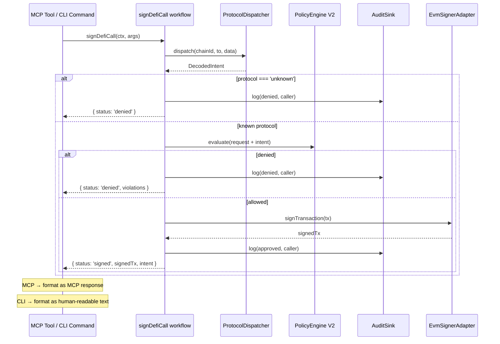
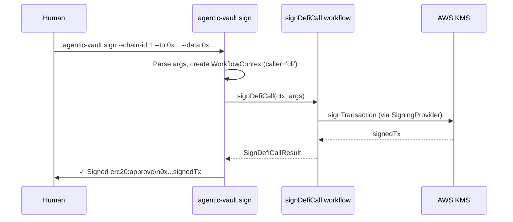
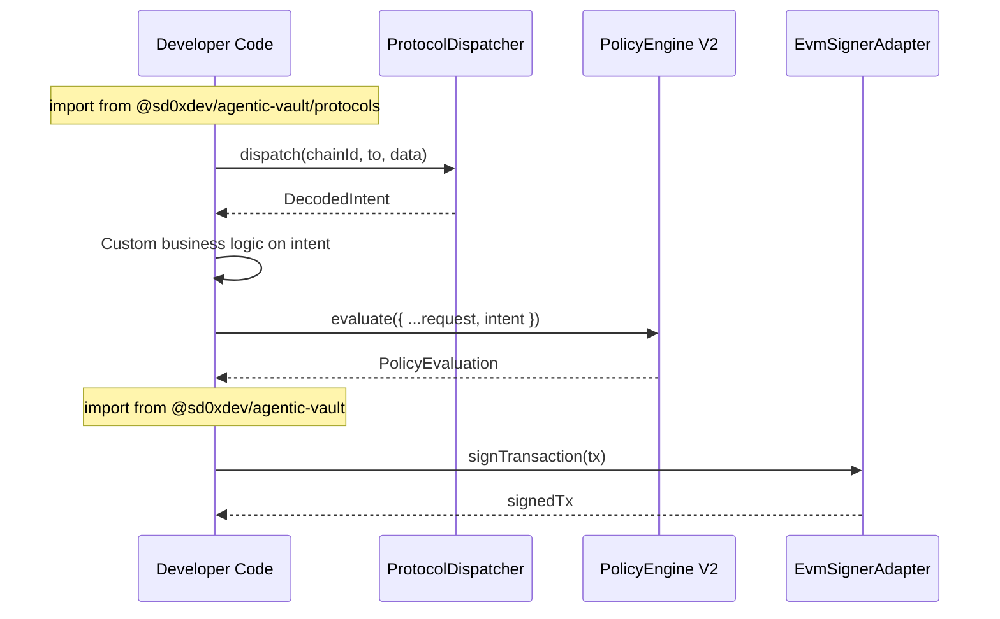

# DeFi Protocol Integration — Technical Specification

> Based on [Feasibility Study](./0-feasibility-study.md) — Solution C (Hybrid: viem-native wallet + external DeFi router)
> Architecture updated per interface-agnostic brainstorm (2026-02-13)

## 1. Overview

| Field | Value |
| --- | --- |
| Feature | Calldata-aware DeFi signing with protocol-level policy enforcement |
| Scope | Protocol decoder framework, Policy V2, `sign_defi_call` MCP tool, `sign_swap` upgrade |
| Protocols | ERC-20, Uniswap V3 (SwapRouter02), Aave V3 (Pool) |
| Dependencies | Zero new runtime dependencies (viem-native) |
| Core impact | `src/core/` unchanged |

### 1.1 Consumer Patterns

The protocol decoder and policy engine are **interface-agnostic**. Phase 6 extracted shared business logic into `src/protocols/workflows/`, consumed by all surface areas:

| Consumer | Entry | Interface | What They Get |
| --- | --- | --- | --- |
| Human (CLI) [Phase 6b] | `agentic-vault sign` | Interactive CLI | Same decode+policy+sign pipeline, human-readable output |
| AI Agent (MCP) | MCP `sign_defi_call` / `sign_swap` | MCP transport | Full decode+policy+sign pipeline |
| Developer (SDK) | `@sd0xdev/agentic-vault/protocols` | TypeScript SDK | Dispatcher, PolicyEngine, Decoders — no MCP/CLI pulled (Workflows added in Phase 6a) |
| Claude Code (skills) | Skills → MCP tools | Skill markdown | Governance-consistent signing |
| Backend service | `./protocols` + `.` (signer) | TypeScript SDK | Custom orchestration without MCP |

> **Design principle**: All consumers share the same workflow layer. Interface adapters (MCP tools, CLI commands) are thin I/O adapters that parse input → call workflow → format output.

### 1.2 Package Subpath Exports

```json
{
  ".":           { "types": "./dist/index.d.ts",           "import": "./dist/index.js" },
  "./protocols": { "types": "./dist/protocols/index.d.ts", "import": "./dist/protocols/index.js" },
  "./agentic":   { "types": "./dist/agentic/index.d.ts",   "import": "./dist/agentic/index.js" }
}
```

| Subpath | Contents | MCP dependency |
| --- | --- | --- |
| `.` | Core signing (SigningProvider, EvmSignerAdapter, factory) + type-only re-exports of PolicyConfig/PolicyRequest/PolicyEvaluation/AuditEntry (backward compat, deprecated) | No |
| `./protocols` | Protocol decoder, dispatcher, PolicyEngine V2 (canonical path for policy types) | No |
| `./agentic` | MCP server, CLI, audit logger | Yes |

> **Backward compat note**: Current `src/index.ts` re-exports `PolicyConfig`, `PolicyRequest`, `PolicyEvaluation`, and `AuditEntry` as type-only. These are preserved in v0.1.x for backward compat but deprecated — consumers should migrate to `@sd0xdev/agentic-vault/protocols`.

## 2. Architecture

### 2.1 Layer Diagram

```
┌─────────────────────────────────────────────────────────────────────┐
│            Layer 3: Interface Adapters (thin I/O)                    │
│                                                                     │
│  ┌─── MCP (src/agentic/mcp/) ─✅─┐  ┌── CLI (src/cli/) [Phase 6] ┐ │
│  │ sign_swap │ sign_defi_call    │  │ sign │ sign-permit │ dry-run│ │
│  │ sign_permit │ MCP Server      │  │ get-address │ health │ mcp  │ │
│  └──────────────┬────────────────┘  └──────────┬─────────────────┘ │
└─────────────────┼──────────────────────────────┼───────────────────┘
                  │                              │
     ┌────────────▼──────────────────────────────▼──────────────┐
     │  Layer 2b: Workflows (src/protocols/workflows/) [Phase 6]│
     │  signDefiCall(ctx) → SignDefiCallResult                  │
     │  signPermit(ctx) → SignPermitResult                      │
     │  AuditSink injection │ caller tag │ typed domain results │
     └────────────────────────────┬─────────────────────────────┘
                                  │
     ┌────────────────────────────▼─────────────────────────────┐
     │  Layer 2a: Protocol Logic (src/protocols/)               │
     │  ProtocolDispatcher → Decoders → PolicyEngine V2         │
     └─────┬──────┬──────┬──────┬───────────────────────────────┘
           │      │      │      │
    ┌──────▼┐ ┌───▼──┐ ┌─▼───┐ ┌▼────────┐
    │ERC-20 │ │Uni V3│ │Aave │ │ Unknown  │
    │decoder│ │decode│ │ V3  │ │→ REJECT  │
    └───────┘ └──────┘ └─────┘ └─────────┘
                                  │
     ┌────────────────────────────▼─────────────────────────────┐
     │  Layer 1: Core Signing (unchanged)                       │  src/core/
     │  SigningProvider → EvmSignerAdapter                      │
     └─────────────────────────────────────────────────────────┘
```

### 2.2 File Structure

#### Current State

```
src/
├── core/                         # Layer 1: Signing (unchanged)
│   ├── signing-provider.ts
│   └── evm-signer-adapter.ts
├── protocols/                    # Layer 2a: Protocol logic ✅
│   ├── index.ts                  # Public entrypoint for ./protocols subpath
│   ├── types.ts                  # DecodedIntent, ProtocolDecoder interfaces
│   ├── catalog.ts                # Protocol Action Catalog (shared ABI metadata) [Phase 7a]
│   ├── registry.ts               # Contract registry (chainId+address → protocol)
│   ├── dispatcher.ts             # dispatch(chainId, to, data) → DecodedIntent
│   ├── decoders/
│   │   ├── erc20.ts              # ERC-20 ABI + decoder ✅
│   │   └── uniswap-v3.ts         # Uniswap V3 SwapRouter02 ABI + decoder ✅
│   └── policy/
│       ├── types.ts              # PolicyConfigV2, PolicyRequestV2, ProtocolPolicyEvaluator
│       ├── engine.ts             # PolicyEngine (V1 evolved to V2 in place) ✅
│       └── evaluators/
│           ├── erc20.ts          # ERC-20 policy (allowance cap, spender allowlist) ✅
│           └── uniswap-v3.ts     # Uniswap policy (token pair, slippage, recipient) ✅
├── provider/                     # Provider factory (unchanged)
├── providers/                    # Provider implementations (unchanged)
├── agentic/                      # Layer 3: MCP interface
│   ├── audit/                    # AuditLogger
│   ├── policy/                   # Re-export bridge (deprecated → use ./protocols)
│   ├── mcp/
│   │   ├── server.ts             # Injects default ProtocolDispatcher
│   │   └── tools/
│   │       ├── shared.ts         # ToolContext with optional dispatcher
│   │       ├── decoded-call-pipeline.ts  # Shared decode→policy→sign pipeline
│   │       ├── sign-defi-call.ts # DeFi signing with decoder
│   │       ├── sign-swap.ts      # Routes through decoder pipeline
│   │       └── ...               # Existing tools unchanged
│   ├── cli.ts                    # MCP server CLI entry
│   └── index.ts                  # Re-exports PolicyEngine + protocol types
└── index.ts                      # Root exports (core + provider)
```

#### Target State (Phase 4 + Phase 6)

Phase 4 adds Aave V3 decoder/evaluator. Phase 6 adds workflow layer and CLI.

```
src/protocols/
│   ├── decoders/
│   │   └── aave-v3.ts            # Aave V3 Pool ABI + decoder [Phase 4]
│   ├── policy/evaluators/
│   │   └── aave-v3.ts            # Aave policy [Phase 4]
│   └── workflows/                # Layer 2b: Shared business logic [Phase 6a]
│       ├── types.ts              # WorkflowContext, AuditSink, domain result types
│       ├── sign-defi-call.ts     # decode → policy → sign → audit → domain result
│       └── sign-permit.ts        # validate → policy → sign → audit → domain result
src/cli/                          # Layer 3: CLI interface adapter [Phase 6b+7]
│   ├── index.ts                  # CLI entry, manual switch routing
│   ├── commands/
│   │   ├── sign.ts               # sign subcommand → workflow → output (+TTY confirm, --yes) [7e]
│   │   ├── sign-permit.ts        # sign-permit subcommand → workflow → output (+--file) [7d]
│   │   ├── dry-run.ts            # dry-run subcommand → decode only (no signing) (+stdin) [7c]
│   │   ├── encode.ts             # encode subcommand → intent params → calldata [7a]
│   │   ├── decode.ts             # decode subcommand → calldata → intent JSON [7a]
│   │   ├── get-address.ts        # get-address subcommand
│   │   ├── health.ts             # health subcommand
│   │   └── mcp.ts                # mcp subcommand (starts stdio MCP server)
│   └── formatters.ts             # Output formatters + stdin + TTY helpers [7b/7c/7e]
```

> **Binary naming (Phase 6b)**: `agentic-vault` (main entry) + `agentic-vault-mcp` (compat alias, equivalent to `agentic-vault mcp`). Both defined in `package.json` `bin` field.

### 2.3 Trust Boundary

| Module | Allowed Imports | Prohibited |
| --- | --- | --- |
| `src/protocols/**` | `viem`, internal protocol modules, `src/core/**` (direct) | `@modelcontextprotocol/*`, `src/agentic/**` |
| `src/agentic/**` | `src/index.js` (root) + `src/protocols/index.js` (via relative path) | Direct `src/core/**`, `src/providers/**` |
| `src/core/**` | `viem`, internal core modules | `src/agentic/**`, `src/protocols/**` |

The trust boundary test (`test/unit/agentic/trust-boundary.test.ts`) resolves each relative import path and checks against two allowed targets:

```typescript
// test/unit/agentic/trust-boundary.test.ts:83-86
const allowedTargets = [
  resolve(srcDir, 'index.js'),              // root public API
  resolve(srcDir, 'protocols', 'index.js'), // protocols public API
];
```

Import asymmetry is intentional:
- `src/protocols/` is a peer domain module — imports from `src/core/` and `viem` directly (no agentic trust-boundary restriction, but still has layered import constraints per the table above)
- `src/agentic/` is the outer interface boundary — imports only through public entrypoints (`index.js`, `protocols/index.js`)

### 2.4 Backward Compatibility Bridge

Existing consumers import `PolicyEngine` from `@sd0xdev/agentic-vault/agentic`. The policy engine moves to `src/protocols/policy/`, so `src/agentic/index.ts` re-exports it:

```typescript
// src/agentic/index.ts — compatibility bridge
// @deprecated Use @sd0xdev/agentic-vault/protocols instead
export { PolicyEngine } from '../protocols/policy/engine.js';
export type { PolicyConfig, PolicyRequest, PolicyEvaluation } from '../protocols/policy/types.js';
```

This bridge will be removed in a future version. The canonical import path is `@sd0xdev/agentic-vault/protocols`.

## 3. Type Definitions

### 3.1 DecodedIntent

```typescript
// src/protocols/types.ts

import type { Address, Hex } from 'viem';

// -- Base fields shared by all decoded intents --
interface IntentBase {
  chainId: number;
  to: Address;
  selector: Hex;
}

// -- ERC-20 --
interface Erc20ApproveIntent extends IntentBase {
  protocol: 'erc20';
  action: 'approve';
  args: { spender: Address; amount: bigint };
}

interface Erc20TransferIntent extends IntentBase {
  protocol: 'erc20';
  action: 'transfer';
  args: { to: Address; amount: bigint };
}

// -- Uniswap V3 --
interface UniswapV3ExactInputSingleIntent extends IntentBase {
  protocol: 'uniswap_v3';
  action: 'exactInputSingle';
  args: {
    tokenIn: Address;
    tokenOut: Address;
    fee: number;
    recipient: Address;
    amountIn: bigint;
    amountOutMinimum: bigint;
    sqrtPriceLimitX96: bigint;
  };
}

// -- Aave V3 --
interface AaveV3SupplyIntent extends IntentBase {
  protocol: 'aave_v3';
  action: 'supply';
  args: { asset: Address; amount: bigint; onBehalfOf: Address; referralCode: number };
}

interface AaveV3BorrowIntent extends IntentBase {
  protocol: 'aave_v3';
  action: 'borrow';
  args: {
    asset: Address; amount: bigint; interestRateMode: bigint;
    referralCode: number; onBehalfOf: Address;
  };
}

interface AaveV3RepayIntent extends IntentBase {
  protocol: 'aave_v3';
  action: 'repay';
  args: { asset: Address; amount: bigint; interestRateMode: bigint; onBehalfOf: Address };
}

interface AaveV3WithdrawIntent extends IntentBase {
  protocol: 'aave_v3';
  action: 'withdraw';
  args: { asset: Address; amount: bigint; to: Address };
}

// -- Unknown (always rejected) --
interface UnknownIntent {
  protocol: 'unknown';
  chainId: number;
  to: Address;
  selector?: Hex;
  rawData: Hex;
  reason: string;
}

// -- Discriminated union --
export type DecodedIntent =
  | Erc20ApproveIntent
  | Erc20TransferIntent
  | UniswapV3ExactInputSingleIntent
  | AaveV3SupplyIntent
  | AaveV3BorrowIntent
  | AaveV3RepayIntent
  | AaveV3WithdrawIntent
  | UnknownIntent;

// -- Protocol decoder interface --
export interface ProtocolDecoder {
  readonly protocol: string;
  readonly supportedSelectors: readonly Hex[];
  decode(chainId: number, to: Address, data: Hex): DecodedIntent;
}
```

### 3.2 Contract Registry

```typescript
// src/protocols/registry.ts

import type { Address, Hex } from 'viem';
import type { ProtocolDecoder } from './types.js';

export interface ContractEntry {
  protocol: string;
  decoder: ProtocolDecoder;
}

export interface RegistryConfig {
  contracts: Record<string, ContractEntry>;  // key: `${chainId}:${lowercase address}`
  interfaceDecoders: ProtocolDecoder[];      // fallback: match by selector (e.g., ERC-20)
}

export class ProtocolRegistry {
  private readonly addressMap: Map<string, ContractEntry>;
  private readonly interfaceDecoders: ProtocolDecoder[];

  constructor(config: RegistryConfig) {
    this.addressMap = new Map(Object.entries(config.contracts));
    this.interfaceDecoders = config.interfaceDecoders;
  }

  /**
   * Lookup protocol by chainId + contract address (Stage 1).
   * Falls back to interface-based decoder matching by selector (Stage 2).
   */
  resolve(chainId: number, to: Address, selector: Hex): ProtocolDecoder | undefined {
    const key = `${chainId}:${to.toLowerCase()}`;
    const entry = this.addressMap.get(key);
    if (entry) return entry.decoder;

    const normalizedSelector = selector.toLowerCase() as Hex;
    return this.interfaceDecoders.find(
      (d) => d.supportedSelectors.some((s) => s.toLowerCase() === normalizedSelector),
    );
  }
}
```

### 3.3 Policy Engine V2

```typescript
// src/protocols/policy/types.ts

import type { Address } from 'viem';
import type { DecodedIntent } from '../types.js';

// -- V1 types (preserved, backward compatible) --
export interface PolicyConfig { /* ... existing ... */ }
export interface PolicyRequest { /* ... existing ... */ }
export interface PolicyEvaluation { /* ... existing ... */ }

// -- V2 extensions --
export interface PolicyRequestV2 extends PolicyRequest {
  intent?: DecodedIntent;
}

export interface ProtocolPolicyConfig {
  tokenAllowlist?: Address[];
  recipientAllowlist?: Address[];
  maxSlippageBps?: number;
  maxInterestRateMode?: number;
  maxAllowanceWei?: bigint;
}

export interface PolicyConfigV2 extends PolicyConfig {
  protocolPolicies?: Record<string, ProtocolPolicyConfig>;  // key: protocol name
}

// -- Protocol evaluator interface --
// Returns string[] (violations), not PolicyEvaluation — engine aggregates violations.
export interface ProtocolPolicyEvaluator {
  readonly protocol: string;
  evaluate(intent: DecodedIntent, config: ProtocolPolicyConfig): string[];
}
```

## 4. Module Specifications

### 4.1 Protocol Decoders

Each decoder module follows the same pattern:

```typescript
// src/protocols/decoders/erc20.ts

import { decodeFunctionData, type Address, type Hex } from 'viem';
import type { DecodedIntent, ProtocolDecoder } from '../types.js';

const erc20Abi = [
  {
    name: 'approve', type: 'function', stateMutability: 'nonpayable',
    inputs: [
      { name: 'spender', type: 'address' },
      { name: 'amount', type: 'uint256' },
    ],
    outputs: [{ name: '', type: 'bool' }],
  },
  {
    name: 'transfer', type: 'function', stateMutability: 'nonpayable',
    inputs: [
      { name: 'to', type: 'address' },
      { name: 'amount', type: 'uint256' },
    ],
    outputs: [{ name: '', type: 'bool' }],
  },
] as const;

export const erc20Decoder: ProtocolDecoder = {
  protocol: 'erc20',
  supportedSelectors: ['0x095ea7b3', '0xa9059cbb'],  // approve, transfer

  decode(chainId: number, to: Address, data: Hex): DecodedIntent {
    try {
      const { functionName, args } = decodeFunctionData({ abi: erc20Abi, data });
      const selector = data.slice(0, 10).toLowerCase() as Hex;

      switch (functionName) {
        case 'approve':
          return {
            protocol: 'erc20', action: 'approve',
            chainId, to, selector,
            args: { spender: args[0], amount: args[1] },
          };
        case 'transfer':
          return {
            protocol: 'erc20', action: 'transfer',
            chainId, to, selector,
            args: { to: args[0], amount: args[1] },
          };
        default:
          return { protocol: 'unknown', chainId, to, selector, rawData: data,
                   reason: `Unsupported ERC-20 function: ${functionName}` };
      }
    } catch {
      return { protocol: 'unknown', chainId, to, rawData: data,
               reason: 'Failed to decode ERC-20 calldata' };
    }
  },
};
```

Uniswap V3 and Aave V3 decoders follow the same pattern with their respective ABI fragments (see [feasibility study](./0-feasibility-study.md#aave-v3-pool-abi-reference-viem-native) for ABI references).

### 4.2 Dispatcher

```typescript
// src/protocols/dispatcher.ts

import type { Address, Hex } from 'viem';
import type { DecodedIntent } from './types.js';
import { ProtocolRegistry, type RegistryConfig } from './registry.js';

export class ProtocolDispatcher {
  private readonly registry: ProtocolRegistry;

  constructor(config: RegistryConfig) {
    this.registry = new ProtocolRegistry(config);
  }

  dispatch(chainId: number, to: Address, data: Hex): DecodedIntent {
    if (data.length < 10) {
      return {
        protocol: 'unknown', chainId, to, rawData: data,
        reason: 'Calldata too short (no 4-byte selector)',
      };
    }

    const selector = data.slice(0, 10).toLowerCase() as Hex;
    const decoder = this.registry.resolve(chainId, to, selector);

    if (!decoder) {
      return {
        protocol: 'unknown', chainId, to, selector, rawData: data,
        reason: `No registered decoder for contract ${to} on chain ${chainId}`,
      };
    }

    return decoder.decode(chainId, to, data);
  }
}
```

### 4.3 Policy Engine V2

```typescript
// src/protocols/policy/engine.ts (moved from src/agentic/policy/, evolved in place)

export class PolicyEngine {
  private readonly config: PolicyConfigV2;
  private readonly evaluators: Map<string, ProtocolPolicyEvaluator>;

  constructor(config: PolicyConfigV2, evaluators?: ProtocolPolicyEvaluator[]) {
    this.config = config;
    this.evaluators = new Map(
      (evaluators ?? []).map((e) => [e.protocol, e]),
    );
  }

  evaluate(request: PolicyRequestV2): PolicyEvaluation {
    const violations: string[] = [];

    // -- V1 base checks (unchanged) --
    violations.push(...this.evaluateBase(request));

    // -- V2 intent-aware checks (fail-closed) --
    if (request.intent && request.intent.protocol !== 'unknown') {
      const evaluator = this.evaluators.get(request.intent.protocol);
      const protocolConfig = this.config.protocolPolicies?.[request.intent.protocol];

      if (!evaluator || !protocolConfig) {
        // Fail-closed: deny if protocol is known but evaluator/config missing
        violations.push(
          `No policy evaluator/config registered for protocol '${request.intent.protocol}'`,
        );
      } else {
        violations.push(...evaluator.evaluate(request.intent, protocolConfig));
      }
    }

    return { allowed: violations.length === 0, violations };
  }

  private evaluateBase(request: PolicyRequest): string[] {
    // ... existing V1 logic (unchanged) ...
  }
}
```

### 4.4 Protocols Public Entrypoint

```typescript
// src/protocols/index.ts

// Types
export type { DecodedIntent, ProtocolDecoder } from './types.js';
export type { ContractEntry, RegistryConfig } from './registry.js';

// Classes
export { ProtocolRegistry } from './registry.js';
export { ProtocolDispatcher } from './dispatcher.js';

// Decoders
export { erc20Decoder } from './decoders/erc20.js';
export { uniswapV3Decoder } from './decoders/uniswap-v3.js';
// Phase 4: export { aaveV3Decoder } from './decoders/aave-v3.js';

// Policy V2
export { PolicyEngine } from './policy/engine.js';
export type {
  PolicyConfig, PolicyRequest, PolicyEvaluation,
  PolicyConfigV2, PolicyRequestV2,
  ProtocolPolicyConfig, ProtocolPolicyEvaluator,
} from './policy/types.js';

// Default registry factory
export { createDefaultRegistry } from './registry.js';
```

### 4.5 MCP Tool: `sign_defi_call`

> **Note**: 以下為設計時 pseudocode。實際實作使用 refined zod validators（Phase 5b）和共用 `executeDecodedCallPipeline` helper（Phase 5d），詳見 `src/agentic/mcp/tools/sign-defi-call.ts` 和 `src/agentic/mcp/tools/decoded-call-pipeline.ts`。

```typescript
// src/agentic/mcp/tools/sign-defi-call.ts (simplified pseudocode)

import { z } from 'zod';
import { type McpServer } from '@modelcontextprotocol/sdk/server/mcp.js';
import { type ToolContext } from './shared.js';

const inputSchema = {
  chainId: z.number().positive(),
  to: z.string().regex(/^0x[0-9a-fA-F]{40}$/),  // address validation
  data: z.string().regex(/^0x[0-9a-fA-F]+$/),    // hex validation
  value: z.string().optional(),
};

export function registerSignDefiCall(server: McpServer, ctx: ToolContext): void {
  server.registerTool('sign_defi_call', {
    description: 'Sign a DeFi contract interaction after calldata decoding and policy validation',
    inputSchema,
  }, async (args) => {
    const to = args.to.toLowerCase() as `0x${string}`;
    const data = args.data as `0x${string}`;

    // 1. Require dispatcher (runtime guard for optional field)
    if (!ctx.dispatcher) {
      throw new Error('sign_defi_call requires dispatcher in ToolContext');
    }

    // 2. Decode calldata
    const intent = ctx.dispatcher.dispatch(args.chainId, to, data);

    // 3. Reject unknown protocols (fail-closed)
    if (intent.protocol === 'unknown') {
      ctx.auditLogger.log({
        service: 'agentic-vault-mcp', action: 'sign_defi_call',
        who: 'mcp-client',
        what: `Rejected unknown calldata for ${to} on chain ${args.chainId}`,
        why: `Decoder rejection: ${intent.reason}`,
        result: 'denied',
        details: { chainId: args.chainId, to, reason: intent.reason },
      });
      return {
        content: [{ type: 'text' as const,
          text: `Rejected: ${intent.reason}` }],
        isError: true,
      };
    }

    // 4. Parse value
    let amountWei: bigint | undefined;
    if (args.value) {
      try { amountWei = BigInt(args.value); }
      catch { return { content: [{ type: 'text' as const, text: 'Invalid value' }], isError: true }; }
    }

    // 5. Policy evaluation with decoded intent
    const evaluation = ctx.policyEngine.evaluate({
      chainId: args.chainId, to,
      selector: 'selector' in intent ? intent.selector : undefined,
      amountWei,
      intent,
    });

    if (!evaluation.allowed) {
      ctx.auditLogger.log({
        service: 'agentic-vault-mcp', action: 'sign_defi_call',
        who: 'mcp-client',
        what: `Policy denied ${intent.protocol}:${intent.action} on chain ${args.chainId}`,
        why: `Violations: ${evaluation.violations.join('; ')}`,
        result: 'denied',
        details: { chainId: args.chainId, to, protocol: intent.protocol,
                   action: intent.action, violations: evaluation.violations },
      });
      return {
        content: [{ type: 'text' as const,
          text: `Policy denied: ${evaluation.violations.join('; ')}` }],
        isError: true,
      };
    }

    // 6. Sign
    try {
      const signedTx = await ctx.signer.signTransaction({
        chainId: args.chainId, to, data, value: amountWei,
      });

      ctx.auditLogger.log({
        service: 'agentic-vault-mcp', action: 'sign_defi_call',
        who: 'mcp-client',
        what: `Signed ${intent.protocol}:${intent.action} for ${to} on chain ${args.chainId}`,
        why: 'Approved by decoder + policy',
        result: 'approved',
        details: { chainId: args.chainId, to, protocol: intent.protocol, action: intent.action },
      });

      return { content: [{ type: 'text' as const, text: signedTx }] };
    } catch (error) {
      ctx.auditLogger.log({
        service: 'agentic-vault-mcp', action: 'sign_defi_call',
        who: 'mcp-client',
        what: `Failed to sign ${intent.protocol}:${intent.action}`,
        why: 'Signing error',
        result: 'error',
        details: { error: error instanceof Error ? error.message : String(error) },
      });
      return {
        content: [{ type: 'text' as const,
          text: `Signing error: ${error instanceof Error ? error.message : String(error)}` }],
        isError: true,
      };
    }
  });
}
```

### 4.6 `sign_swap` Upgrade

The existing `sign_swap` tool is modified to route through the same decoder pipeline:

```diff
 // src/agentic/mcp/tools/sign-swap.ts

 export function registerSignSwap(server: McpServer, ctx: ToolContext): void {
   server.registerTool('sign_swap', { ... }, async (args) => {
     const to = args.to.toLowerCase() as `0x${string}`;
+    const data = args.data as `0x${string}`;
-    const selector = args.data.length >= 10
-      ? (args.data.slice(0, 10).toLowerCase() as `0x${string}`)
-      : undefined;
+
+    // Require dispatcher (runtime guard for optional field)
+    if (!ctx.dispatcher) {
+      throw new Error('sign_swap requires dispatcher in ToolContext');
+    }
+
+    // Decode calldata via protocol dispatcher
+    const intent = ctx.dispatcher.dispatch(args.chainId, to, data);
+
+    // Reject unknown protocols (fail-closed)
+    if (intent.protocol === 'unknown') {
+      // ... audit log + deny ...
+    }

     // Evaluate policy with decoded intent
     const evaluation = ctx.policyEngine.evaluate({
       chainId: args.chainId,
       to,
-      selector,
+      selector: 'selector' in intent ? intent.selector : undefined,
       amountWei,
+      intent,
     });
     // ... rest unchanged ...
```

### 4.7 ToolContext Extension

> **Trust boundary design**: `shared.ts` 不直接 import `protocols/index.js`。所有 interface 使用 local structural types（如 `ToolDecodedIntent`），透過 TypeScript structural typing 與 protocol layer 的實作相容。

```typescript
// src/agentic/mcp/tools/shared.ts (actual implementation)

/** Minimal decoded intent — structural supertype (no import from protocols/) */
export interface ToolDecodedIntent {
  protocol: string;
  chainId: number;
  to: `0x${string}`;
  selector?: `0x${string}`;
  action?: string;
  args?: Record<string, unknown>;
  rawData?: `0x${string}`;
  reason?: string;
}

/** Minimal policy engine interface (V2 — intent-aware) */
export interface ToolPolicyEngine {
  evaluate(request: {
    chainId: number;
    to: `0x${string}`;
    selector?: `0x${string}`;
    amountWei?: bigint;
    deadline?: number;
    intent?: ToolDecodedIntent;
  }): ToolPolicyEvaluation;
}

/** Protocol dispatcher interface */
export interface ToolDispatcher {
  dispatch(chainId: number, to: `0x${string}`, data: `0x${string}`): ToolDecodedIntent;
}

/** Full context */
export interface ToolContext {
  signer: ToolSigner;
  policyEngine: ToolPolicyEngine;
  auditLogger: ToolAuditLogger;
  dispatcher?: ToolDispatcher;  // optional for backward compat; required by sign_defi_call
}
```

**Backward compatibility**: Existing tools (`get_address`, `health_check`, `sign_permit`, `sign_typed_data`) do not use `dispatcher` and work unchanged. `sign_defi_call` and upgraded `sign_swap` check for `dispatcher` at runtime and throw a clear error if missing. The `createMcpServer` factory injects a default `ProtocolDispatcher` when not provided.

```typescript
// src/agentic/mcp/server.ts (updated)
import { ProtocolDispatcher, createDefaultRegistry } from '../../protocols/index.js';

export function createMcpServer(options: McpServerOptions): McpServer {
  const ctx: ToolContext = {
    signer: options.signer,
    policyEngine: options.policyEngine,
    auditLogger: options.auditLogger,
    dispatcher: options.dispatcher ?? new ProtocolDispatcher(createDefaultRegistry()),
  };
  // ...
}
```

### 4.8 Workflow Layer [Phase 6a ✅]

> 來源：Phase 5 完成後的多介面架構 brainstorming（Claude + Codex Nash Equilibrium，2026-02-13）

Workflows 是 **interface-agnostic 的共用業務邏輯**，位於 `src/protocols/workflows/`。MCP tools 和 CLI commands 都是 thin adapters，呼叫 workflow 後各自格式化輸出。業務邏輯已從 `src/agentic/mcp/tools/decoded-call-pipeline.ts` 提取至 workflows。

#### Types

```typescript
// src/protocols/workflows/types.ts

import type { AuditEntry } from '../../agentic/audit/types.js';
import type { DecodedIntent } from '../types.js';

/** Audit sink interface — decouples workflows from concrete logger */
export interface AuditSink {
  log(entry: AuditEntry): void;
}

/** Workflow context — everything a workflow needs */
export interface WorkflowContext {
  signer: WorkflowSigner;
  policyEngine: WorkflowPolicyEngine;
  dispatcher: WorkflowDispatcher;
  auditSink: AuditSink;
  caller: string;  // 'mcp-client' | 'cli' | 'sdk' | custom
}

/** Domain result for sign-defi-call workflow */
export type SignDefiCallResult =
  | { status: 'signed'; signedTx: string; intent: DecodedIntent }
  | { status: 'denied'; violations: string[]; intent?: DecodedIntent }
  | { status: 'error'; error: string };

/** Domain result for sign-permit workflow */
export type SignPermitResult =
  | { status: 'signed'; signature: { v: number; r: string; s: string } }
  | { status: 'denied'; violations: string[] }
  | { status: 'error'; error: string };
```

#### Workflow Implementation Pattern

```typescript
// src/protocols/workflows/sign-defi-call.ts

export async function signDefiCall(
  ctx: WorkflowContext,
  args: { chainId: number; to: Address; data: Hex; value?: string },
): Promise<SignDefiCallResult> {
  // 1. Decode
  const intent = ctx.dispatcher.dispatch(args.chainId, to, data);

  // 2. Reject unknown (fail-closed)
  if (intent.protocol === 'unknown') {
    ctx.auditSink.log({ /* denied, caller: ctx.caller */ });
    return { status: 'denied', violations: [intent.reason] };
  }

  // 3. Policy evaluation with intent
  const evaluation = ctx.policyEngine.evaluate({ ...request, intent });
  if (!evaluation.allowed) {
    ctx.auditSink.log({ /* denied */ });
    return { status: 'denied', violations: evaluation.violations, intent };
  }

  // 4. Sign
  const signedTx = await ctx.signer.signTransaction({ ... });
  ctx.auditSink.log({ /* approved, caller: ctx.caller */ });
  return { status: 'signed', signedTx, intent };
}
```

#### Adapter Pattern

```typescript
// MCP adapter (thin)
async (args) => {
  const result = await signDefiCall(workflowCtx, args);
  if (result.status === 'signed')
    return { content: [{ type: 'text', text: result.signedTx }] };
  return { content: [{ type: 'text', text: result.violations.join('; ') }], isError: true };
}

// CLI adapter (thin)
async (args) => {
  const result = await signDefiCall(workflowCtx, args);
  if (result.status === 'signed')
    console.log(`✓ Signed ${result.intent.protocol}:${result.intent.action}\n${result.signedTx}`);
  else
    console.error(`✗ Denied: ${result.violations.join('\n  ')}`);
}
```

### 4.9 CLI Design [Phase 6b ✅]

> Binary: `agentic-vault` (main) + `agentic-vault-mcp` (compat alias → `agentic-vault mcp`).

| Subcommand | Description | Requires AWS |
| --- | --- | --- |
| `sign` | Decode calldata → policy → sign → output signed tx | Yes |
| `sign-permit` | Validate EIP-2612 permit → sign → output `{v,r,s}` | Yes |
| `dry-run` | Decode calldata → policy check → output intent (no signing) | No |
| `get-address` | Derive signer address from KMS key | Yes |
| `health` | Check KMS key accessibility | Yes |
| `mcp` | Start MCP stdio server (current `cli.ts` behavior) | Yes |

```
# CLI 使用範例
agentic-vault sign --chain-id 1 --to 0x... --data 0x095ea7b3... --key-id alias/my-key --region us-east-1
agentic-vault dry-run --chain-id 1 --to 0x... --data 0x095ea7b3...
agentic-vault mcp --key-id alias/my-key --region us-east-1  # 等同 agentic-vault-mcp
```

**Security parity**: CLI 與 MCP 共用相同的 PolicyEngine、AuditSink、fail-closed 行為。唯一差異在 I/O 格式（human-readable vs MCP JSON-RPC）。

## 5. Contract Registry Configuration

The registry maps `chainId:contractAddress` to protocol decoders. Initially hardcoded, can be moved to config file later.

```typescript
// src/protocols/registry.ts — createDefaultRegistry() (current)

const defaultRegistry: RegistryConfig = {
  contracts: {
    // Uniswap V3 SwapRouter02 (Ethereum mainnet)
    '1:0x68b3465833fb72a70ecdf485e0e4c7bd8665fc45': {
      protocol: 'uniswap_v3', decoder: uniswapV3Decoder,
    },
    // Uniswap V3 SwapRouter02 (Sepolia testnet)
    '11155111:0x3bfa4769fb09eefc5a80d6e87c3b9c650f7ae48e': {
      protocol: 'uniswap_v3', decoder: uniswapV3Decoder,
    },
    // Phase 4: Aave V3 Pool (Ethereum mainnet) — planned
    // '1:0x87870bca3f3fd6335c3f4ce8392d69350b4fa4e2': {
    //   protocol: 'aave_v3', decoder: aaveV3Decoder,
    // },
  },
  // ERC-20 matched by selector (any contract)
  interfaceDecoders: [erc20Decoder],
};
```

## 6. Sequence Diagrams

### 6.1 Workflow-Based Flow [Phase 6 ✅] (MCP + CLI 共用)



### 6.2 CLI Interaction [Phase 6b ✅]



### 6.3 Programmatic API Usage (Developer)



## 7. Test Plan

### Test Files (Current)

| Source | Test | Status |
| --- | --- | --- |
| `src/protocols/types.ts` | N/A (types only) | — |
| `src/protocols/registry.ts` | `test/unit/protocols/registry.test.ts` | ✅ |
| `src/protocols/dispatcher.ts` | `test/unit/protocols/dispatcher.test.ts` | ✅ |
| `src/protocols/decoders/erc20.ts` | `test/unit/protocols/decoders/erc20.test.ts` | ✅ |
| `src/protocols/decoders/uniswap-v3.ts` | `test/unit/protocols/decoders/uniswap-v3.test.ts` | ✅ |
| `src/protocols/policy/engine.ts` | `test/unit/protocols/policy/engine.test.ts` | ✅ |
| `src/protocols/policy/evaluators/erc20.ts` | `test/unit/protocols/policy/evaluators/erc20.test.ts` | ✅ |
| `src/protocols/policy/evaluators/uniswap-v3.ts` | `test/unit/protocols/policy/evaluators/uniswap-v3.test.ts` | ✅ |
| `src/protocols/workflows/sign-defi-call.ts` | `test/unit/protocols/workflows/sign-defi-call.test.ts` | ✅ |
| `src/protocols/workflows/sign-permit.ts` | `test/unit/protocols/workflows/sign-permit.test.ts` | ✅ |
| `src/protocols/workflows/get-address.ts` | `test/unit/protocols/workflows/get-address.test.ts` | ✅ |
| `src/protocols/workflows/health-check.ts` | `test/unit/protocols/workflows/health-check.test.ts` | ✅ |
| `src/agentic/mcp/tools/sign-defi-call.ts` | `test/unit/agentic/mcp/tools/sign-defi-call.test.ts` | ✅ |
| `src/agentic/mcp/tools/sign-swap.ts` | `test/unit/agentic/mcp/tools/sign-swap.test.ts` | ✅ |
| `src/agentic/mcp/tools/result-adapter.ts` | `test/unit/agentic/mcp/tools/result-adapter.test.ts` | ✅ |
| `src/agentic/mcp/tools/index.ts` | `test/unit/agentic/security/unsafe-flag.test.ts` | ✅ |
| `src/cli/index.ts` | `test/unit/cli/index.test.ts` | ✅ |
| `src/cli/context.ts` | `test/unit/cli/context.test.ts` | ✅ |
| `src/cli/commands/sign.ts` | `test/unit/cli/commands/sign.test.ts` | ✅ |
| `src/cli/commands/sign-permit.ts` | `test/unit/cli/commands/sign-permit.test.ts` | ✅ |
| `src/cli/commands/dry-run.ts` | `test/unit/cli/commands/dry-run.test.ts` | ✅ |
| `src/cli/commands/get-address.ts` | `test/unit/cli/commands/get-address.test.ts` | ✅ |
| `src/cli/commands/health.ts` | `test/unit/cli/commands/health.test.ts` | ✅ |
| `src/cli/commands/mcp.ts` | `test/unit/cli/commands/mcp.test.ts` | ✅ |
| Trust boundary (agentic) | `test/unit/agentic/trust-boundary.test.ts` | ✅ |
| Trust boundary (protocols) | `test/unit/protocols/trust-boundary.test.ts` | ✅ |
| Trust boundary (CLI) | `test/unit/cli/trust-boundary.test.ts` | ✅ |
| `src/protocols/catalog.ts` | `test/unit/protocols/catalog.test.ts` | ✅ |
| `src/cli/formatters.ts` | `test/unit/cli/formatters.test.ts` | ✅ |
| `src/cli/commands/encode.ts` | `test/unit/cli/commands/encode.test.ts` | ✅ |
| `src/cli/commands/decode.ts` | `test/unit/cli/commands/decode.test.ts` | ✅ |

### Test Files (Planned)

| Source | Test | Phase |
| --- | --- | --- |
| `src/protocols/decoders/aave-v3.ts` | `test/unit/protocols/decoders/aave-v3.test.ts` | Phase 4 |
| `src/protocols/policy/evaluators/aave-v3.ts` | `test/unit/protocols/policy/evaluators/aave-v3.test.ts` | Phase 4 |

### Test Coverage Requirements

| Category | Cases |
| --- | --- |
| Decoder: happy path | Each supported function decodes correctly |
| Decoder: malformed calldata | Returns `protocol: 'unknown'` |
| Decoder: wrong ABI | Returns `protocol: 'unknown'` (graceful fallback) |
| Registry: address match | Known contract resolves to correct decoder |
| Registry: selector fallback | ERC-20 tokens resolved by selector |
| Registry: no match | Returns `undefined` |
| Policy V2: intent-aware | Protocol evaluator invoked when intent present |
| Policy V2: backward compat | V1 requests (no intent) still work |
| Policy V2: fail-closed | Known protocol without evaluator/config → denied |
| sign_defi_call: unknown reject | Returns error, audit logged as denied |
| sign_defi_call: policy deny | Returns violations, audit logged |
| sign_defi_call: sign success | Returns signedTx, audit logged as approved |
| sign_swap: upgraded pipeline | Routes through decoder, rejects unknown |
| **Phase 6a** Workflow: signDefiCall | decode → policy → sign → audit with correct caller tag |
| **Phase 6a** Workflow: signPermit | validate → policy → sign → audit |
| **Phase 6a** Workflow: AuditSink injection | Verify caller tag propagated ('mcp-client', 'cli', 'sdk') |
| **Phase 6b** CLI: sign subcommand | Parses args → calls workflow → human output |
| **Phase 6b** CLI: dry-run subcommand | Decode only, no signing invoked |
| **Phase 6b** CLI: mcp subcommand | Starts MCP server (existing behavior) |
| Trust boundary | `src/agentic/` imports only from allowed entrypoints |
| Protocols boundary | `src/protocols/` does not import MCP modules |
| **Phase 7a** Catalog: shared ABI | Action Catalog entries match decoder ABI selectors |
| **Phase 7a** CLI: encode subcommand | Intent params → correct calldata for all registered actions |
| **Phase 7a** CLI: decode subcommand | Calldata → intent JSON via ProtocolDispatcher |
| **Phase 7b** CLI: --output flag | json/human/raw format variants for all subcommands |
| **Phase 7c** CLI: stdin support | `--data -` reads from stdin correctly |
| **Phase 7d** CLI: permit --file | Auto-extraction from JSON with validation |
| **Phase 7e** CLI: TTY confirmation | Interactive confirm in TTY, auto-skip in non-TTY, `--yes` override |

### Test Data

Use viem's `encodeFunctionData` to generate real calldata in tests:

```typescript
import { encodeFunctionData } from 'viem';

const approveCalldata = encodeFunctionData({
  abi: erc20Abi,
  functionName: 'approve',
  args: ['0xspender...', 1000000n],
});
```

## 8. Security Considerations

| Threat | Mitigation |
| --- | --- |
| Blind calldata signing | Decoder rejects unknown protocols (fail-closed) |
| Prompt-injection via crafted calldata | Decoded args validated by protocol-specific policy |
| Selector collision (different contract, same selector) | 2-stage dispatch: address-first, selector-second |
| ERC-20 unlimited approval | `maxAllowanceWei` in protocol policy config |
| Uniswap slippage manipulation | Non-zero `amountOutMinimum` guard when `maxSlippageBps` set（完整 bps 驗證需 oracle，deferred） |
| Recipient substitution | `recipientAllowlist` enforces known addresses |
| Aave interest rate mode abuse | `maxInterestRateMode` in protocol policy config |
| Legacy tool bypass | `sign_swap` routes through same decoder pipeline |
| ABI spoofing (valid calldata, wrong semantic) | Address-first dispatch binds contract to expected ABI |
| Protocol decoder import leaks MCP deps | `src/protocols/` has no MCP imports; enforced by boundary test |
| V1 policy bypass (no intent) | MCP tools always inject intent via dispatcher; programmatic SDK callers who omit `intent` get V1 base checks only — documented tradeoff for backward compat |
| **`sign_permit` message-vs-args bypass** | **Phase 5a: 以 EIP-712 message 為 single source of truth，嚴格比對 value/spender/deadline** |
| **MCP input schema injection** | **Phase 5b: zod refinement 驗證 hex/address 格式** |
| Interface security drift | **Phase 6 ✅**: Workflow layer 保證所有介面（MCP/CLI/SDK）共用相同 policy + audit + fail-closed 行為 |

## 9. Migration Plan

### Phase 1: Protocol Decoder Framework + Policy V1 Migration ✅

1. Create `src/protocols/` module (types, registry, dispatcher)
2. Move `src/agentic/policy/` → `src/protocols/policy/` (evolve V1 → V2 in place)
3. Add `src/agentic/policy/` re-export bridge (deprecated)
4. Add `./protocols` subpath to `package.json`
5. Update trust boundary test + ESLint config
6. Update `src/agentic/index.ts` re-exports

### Phase 2: ERC-20 Decoder + Evaluator ✅

1. Add `src/protocols/decoders/erc20.ts`
2. Add `src/protocols/policy/evaluators/erc20.ts`
3. Unit tests for decoder and evaluator
4. Update `loadPolicyConfig()` in `cli.ts` to parse V2 fields

### Phase 3: MCP Tools + Uniswap V3 ✅ (CLI wiring deferred to Phase 5c)

1. Add `sign_defi_call` MCP tool
2. Upgrade `sign_swap` to use decoder pipeline
   - **Breaking behavior change**: Short/undecodable calldata (currently accepted) will be rejected. Intentional for security (fail-closed).
3. Add Uniswap V3 decoder + evaluator
4. Update `ToolContext` with optional `dispatcher`; `createMcpServer` injects default
5. Update tool registration in `index.ts`

> **Note**: Uniswap V3 decoder/evaluator 完成。CLI evaluator 接線原延至 Phase 5c，已於 Phase 5 完成。`createMcpServer` 和 CLI 路徑均已正確接線。

### Phase 4: Aave V3

1. Add Aave V3 decoder (supply/borrow/repay/withdraw)
2. Add Aave V3 policy evaluator
3. Register Aave V3 contracts in registry
4. Tests for all Aave actions

### Phase 5: Security Hardening + Code Quality

> 來源：Phase 3 完成後的對抗式 brainstorming（Claude + Codex 獨立研究）

#### 5a. `sign_permit` message-vs-args bypass 修復 ✅

以 EIP-712 `message` 為 single source of truth，嚴格比對 `value`, `spender`, `deadline` 一致性（`sign-permit.ts:126`）。

#### 5b. MCP Input Schema 結構驗證 ✅

加入 zod refinement — `zodHexAddress`、`zodHexData`、`zodPositiveChainId`（`shared.ts:9-21`）。

#### 5c. CLI Evaluator 接線補全 ✅

CLI 已註冊 `erc20Evaluator` 和 `uniswapV3Evaluator`（`cli.ts:116`）。

#### 5d. `sign_swap` / `sign_defi_call` 重複消除 ✅

已提取共用 `executeDecodedCallPipeline` helper（`decoded-call-pipeline.ts`），兩個 tool handler 均呼叫此 helper。Phase 6a 將進一步提取至 workflow layer。

#### 5e. PolicyEngine `Set` 預處理 ✅

Constructor 已預處理 `allowedChainIds`、`allowedContracts`、`allowedSelectors` 為 `Set`（`engine.ts:21-23`）。

### Phase 6: Multi-Interface Architecture (Workflow + CLI) ✅

> 來源：Phase 5 完成後的多介面 brainstorming（Claude + Codex Nash Equilibrium）

#### 6a. Extract Workflow Layer ✅

1. Created `src/protocols/workflows/types.ts`（AuditSink, WorkflowContext, domain result types）
2. Created `src/protocols/workflows/sign-defi-call.ts`（從 `decoded-call-pipeline.ts` 提取）
3. Created `src/protocols/workflows/sign-permit.ts`（從 `sign-permit.ts` 提取 security logic）
4. Created `src/protocols/workflows/get-address.ts` + `health-check.ts`
5. MCP tools 重構為 thin adapters + `result-adapter.ts` 共用 converter
6. 375 unit + 12 E2E tests 全部通過

#### 6b. CLI Entry ✅

1. Created `src/cli/index.ts`（手動 switch routing，零依賴）
2. 實作 6 subcommands: `sign`, `sign-permit`, `dry-run`, `get-address`, `health`, `mcp`
3. `mcp` subcommand 呼叫既有 `startStdioServer`
4. `package.json` 新增 `agentic-vault` + `agentic-vault-mcp` 雙 bin entry
5. CLI commands 呼叫 workflows with `caller: 'cli'`
6. 9 CLI test files + 3 trust boundary tests

#### 6c. SDK Export ✅

1. Workflows exported via `./protocols` subpath
2. `./protocols` subpath 不拉入 MCP/CLI 依賴（trust boundary test 驗證）

### Phase 7: CLI UX Improvements ✅

> 來源：Phase 6b 完成後的 CLI 介面體驗 brainstorming（Claude + Codex Nash Equilibrium，Codex thread: `019c5a01-4b71-72f1-87fe-d55d291e5a74`）

#### 7a. `encode` / `decode` Subcommands（Priority #1）

目前使用者必須手動組裝 raw hex calldata（`--data 0x095ea7b3...`），DX 門檻高。新增 `encode` / `decode` subcommands，復用既有 decoder ABIs：

```bash
# encode: intent → calldata hex
agentic-vault encode erc20:approve \
  --spender 0x68b3465833fb72A70ecDF485E0e4C7bD8665Fc45 \
  --amount 1000000
# → 0x095ea7b3000000000000000000000000...

# decode: calldata hex → intent JSON
agentic-vault decode \
  --chain-id 1 \
  --to 0xa0b86991c6218b36c1d19d4a2e9eb0ce3606eb48 \
  --data 0x095ea7b3...
# → { "protocol": "erc20", "action": "approve", ... }
```

核心概念：**Protocol Action Catalog** — 共用 ABI metadata 讓 decoder 和 encoder 使用同一來源，避免 drift。

```typescript
// src/protocols/catalog.ts
export interface ProtocolAction {
  protocol: string;
  action: string;
  selector: Hex;
  abi: AbiFunction;
  paramNames: string[];   // CLI flag names
}

export const ACTION_CATALOG: Record<string, ProtocolAction> = {
  'erc20:approve': { protocol: 'erc20', action: 'approve', selector: '0x095ea7b3', ... },
  'erc20:transfer': { protocol: 'erc20', action: 'transfer', selector: '0xa9059cbb', ... },
  'uniswap_v3:exactInputSingle': { ... },
};
```

#### 7b. `--output` Global Flag

```bash
agentic-vault dry-run --output json ...    # JSON（目前預設）
agentic-vault dry-run --output human ...   # Human-readable table
agentic-vault dry-run --output raw ...     # Raw hex only
```

#### 7c. stdin Support

```bash
# Pipe calldata from other tools
cast calldata "approve(address,uint256)" 0x... 1000000 | agentic-vault sign --chain-id 1 --to 0x... --data -
echo '0x095ea7b3...' | agentic-vault decode --chain-id 1 --to 0x...
```

#### 7d. Permit Simplification

```bash
# 目前需要 6 個 flags + --payload JSON file
# 簡化為 --file primary（自動從 JSON 提取所有欄位）
agentic-vault sign-permit --key-id ... --region ... --file permit.json
```

#### 7e. Interactive TTY Confirmation

```bash
# TTY 環境下簽名前顯示 intent 並要求確認
agentic-vault sign --chain-id 1 --to 0x... --data 0x...
#  Protocol: ERC-20
#  Action:   approve
#  Spender:  0x68b3...Fc45
#  Amount:   1,000,000 (1 USDC)
#
#  Sign this transaction? [y/N]

# Non-interactive（CI/pipe）自動跳過（stdin+stdout 雙向 TTY 檢測）
agentic-vault sign --yes --chain-id 1 ...
```

### Backward Compatibility

| Component | Compatibility |
| --- | --- |
| `PolicyEngine.evaluate(V1Request)` | Works unchanged (intent is optional) |
| `import from './agentic'` | Re-export bridge preserved (deprecated) |
| `sign_swap` MCP tool | Same input schema, enhanced validation |
| `sign_permit` MCP tool | Schema unchanged; Phase 5a adds stricter message-vs-args consistency validation |
| `sign_transaction` / `sign_typed_data` | Unchanged (still unsafe-gated) |
| `ToolContext` | Extended with optional `dispatcher`; `createMcpServer` injects default |
| CLI flags | No new flags required |
| Policy config JSON | V1 configs work as-is (protocol policies optional) |

## 10. Deferred Decisions

| Item | Rationale | When |
| --- | --- | --- |
| ~~Service layer~~ | ~~Only 1 consumer (MCP) in v0.1.0~~ → **Resolved**: Workflow layer in `src/protocols/workflows/`（Phase 6a） | ✅ Resolved |
| ~~AuditLogger extraction~~ | ~~Currently MCP governance semantics only~~ → **Resolved**: `AuditSink` interface 注入 workflows，`AuditLogger` 實作保留在 `src/agentic/audit/`，CLI 也可注入 | ✅ Resolved |
| ~~CLI framework choice~~ | ~~yargs vs commander vs minimist~~ → **Resolved**: 手動 `switch` routing（零依賴），與 `src/agentic/cli.ts` 模式一致 | ✅ Resolved |
| `./protocols` as standalone npm package | Monorepo split not justified yet | When significant independent consumers exist |
| Skills using programmatic API directly | Skills are markdown → MCP tool calls | When skills framework supports in-process execution |

## 11. Open Decisions

| Decision | Options | Default | When |
| --- | --- | --- | --- |
| Contract registry format | Hardcoded / JSON config file | Hardcoded (Phase 1), config file later | P1 |
| `sign_defi_call` `expectedProtocol` hint | Required / Optional / None | Optional | P3 |
| Policy config file schema | Extend existing / New file | Extend existing `--policy-config` | P2 |
| ~~CLI framework~~ | ~~yargs / commander / minimist~~ | ~~TBD~~ → 手動 switch routing（零依賴） | ✅ Resolved |
| ~~`dry-run` output format~~ | ~~JSON / human-readable / both~~ | ~~TBD~~ → JSON pretty-print（預設） | ✅ Resolved |
| `./cli` subpath export | Export CLI commands for testing / Not export | Not export (internal) | Phase 6c |
| ~~`encode` subcommand scope~~ | ~~All registered protocols / Curated subset~~ | ~~All registered protocols via Action Catalog~~ | ✅ Resolved |
| ~~`--output` format flag~~ | ~~`json` / `human` / `raw`~~ | ~~`json`（default）~~ → `json`/`human`/`raw` implemented | ✅ Resolved |
| ~~Interactive confirmation~~ | ~~TTY-only / `--yes` flag / always~~ | ~~TTY-only with `--yes` override~~ → TTY-only + `--yes` | ✅ Resolved |
