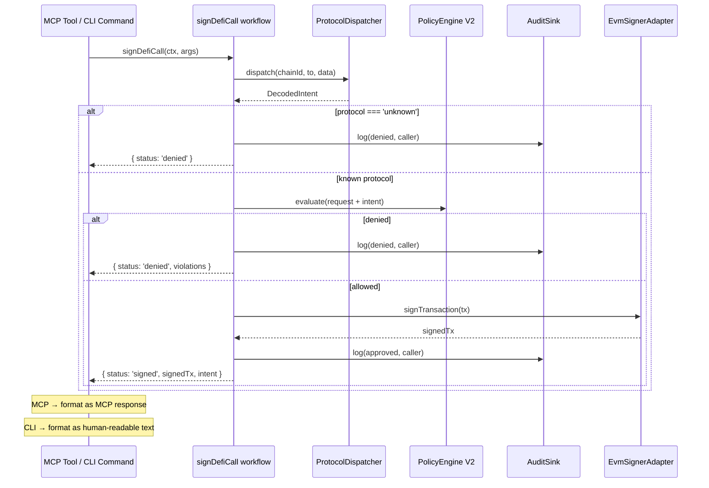
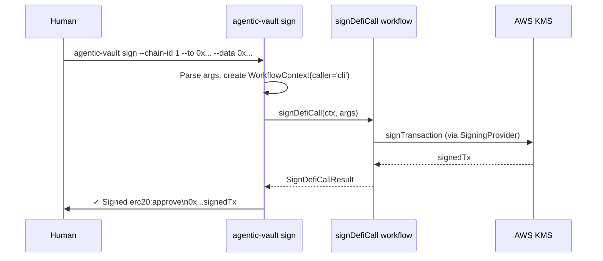
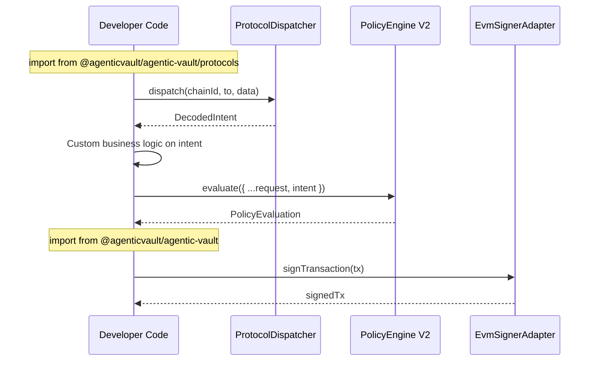

> [← Overview](./0-overview.md) | [Document Index](./0-overview.md#document-index)

## 6. Sequence Diagrams

### 6.1 Workflow-Based Flow [Phase 6 ✅] (MCP + CLI 共用)



### 6.2 CLI Interaction [Phase 6b ✅]



### 6.3 Programmatic API Usage (Developer)



## 7. Test Plan

### Test Files (Current)

| Source | Test | Status |
| --- | --- | --- |
| `src/protocols/types.ts` | N/A (types only) | — |
| `src/protocols/registry.ts` | `test/unit/protocols/registry.test.ts` | ✅ |
| `src/protocols/dispatcher.ts` | `test/unit/protocols/dispatcher.test.ts` | ✅ |
| `src/protocols/decoders/erc20.ts` | `test/unit/protocols/decoders/erc20.test.ts` | ✅ |
| `src/protocols/decoders/uniswap-v3.ts` | `test/unit/protocols/decoders/uniswap-v3.test.ts` | ✅ |
| `src/protocols/policy/engine.ts` | `test/unit/protocols/policy/engine.test.ts` | ✅ |
| `src/protocols/policy/evaluators/erc20.ts` | `test/unit/protocols/policy/evaluators/erc20.test.ts` | ✅ |
| `src/protocols/policy/evaluators/uniswap-v3.ts` | `test/unit/protocols/policy/evaluators/uniswap-v3.test.ts` | ✅ |
| `src/protocols/workflows/sign-defi-call.ts` | `test/unit/protocols/workflows/sign-defi-call.test.ts` | ✅ |
| `src/protocols/workflows/sign-permit.ts` | `test/unit/protocols/workflows/sign-permit.test.ts` | ✅ |
| `src/protocols/workflows/get-address.ts` | `test/unit/protocols/workflows/get-address.test.ts` | ✅ |
| `src/protocols/workflows/health-check.ts` | `test/unit/protocols/workflows/health-check.test.ts` | ✅ |
| `src/agentic/mcp/tools/sign-defi-call.ts` | `test/unit/agentic/mcp/tools/sign-defi-call.test.ts` | ✅ |
| `src/agentic/mcp/tools/sign-swap.ts` | `test/unit/agentic/mcp/tools/sign-swap.test.ts` | ✅ |
| `src/agentic/mcp/tools/result-adapter.ts` | `test/unit/agentic/mcp/tools/result-adapter.test.ts` | ✅ |
| `src/agentic/mcp/tools/index.ts` | `test/unit/agentic/security/unsafe-flag.test.ts` | ✅ |
| `src/cli/index.ts` | `test/unit/cli/index.test.ts` | ✅ |
| `src/cli/context.ts` | `test/unit/cli/context.test.ts` | ✅ |
| `src/cli/commands/sign.ts` | `test/unit/cli/commands/sign.test.ts` | ✅ |
| `src/cli/commands/sign-permit.ts` | `test/unit/cli/commands/sign-permit.test.ts` | ✅ |
| `src/cli/commands/dry-run.ts` | `test/unit/cli/commands/dry-run.test.ts` | ✅ |
| `src/cli/commands/get-address.ts` | `test/unit/cli/commands/get-address.test.ts` | ✅ |
| `src/cli/commands/health.ts` | `test/unit/cli/commands/health.test.ts` | ✅ |
| `src/cli/commands/mcp.ts` | `test/unit/cli/commands/mcp.test.ts` | ✅ |
| Trust boundary (agentic) | `test/unit/agentic/trust-boundary.test.ts` | ✅ |
| Trust boundary (protocols) | `test/unit/protocols/trust-boundary.test.ts` | ✅ |
| Trust boundary (CLI) | `test/unit/cli/trust-boundary.test.ts` | ✅ |
| `src/protocols/catalog.ts` | `test/unit/protocols/catalog.test.ts` | ✅ |
| `src/cli/formatters.ts` | `test/unit/cli/formatters.test.ts` | ✅ |
| `src/cli/commands/encode.ts` | `test/unit/cli/commands/encode.test.ts` | ✅ |
| `src/cli/commands/decode.ts` | `test/unit/cli/commands/decode.test.ts` | ✅ |
| `src/protocols/decoders/aave-v3.ts` | `test/unit/protocols/decoders/aave-v3.test.ts` | ✅ |
| `src/protocols/policy/evaluators/aave-v3.ts` | `test/unit/protocols/policy/evaluators/aave-v3.test.ts` | ✅ |
| `src/protocols/catalog.ts` (Aave actions) | `test/unit/protocols/catalog.test.ts` | ✅ |
| Integration: Sepolia DeFi flow | `test/integration/sepolia-defi-flow.test.ts` | ✅ |

### Test Files (OpenClaw Plugin — Phase 8 ✅ → 8.5 SDK Alignment ✅)

| Source | Test | Status |
| --- | --- | --- |
| `packages/openclaw-plugin/src/tools.ts` | `packages/openclaw-plugin/test/unit/tools.test.ts` | ✅ |
| `packages/openclaw-plugin/src/context.ts` | `packages/openclaw-plugin/test/unit/context.test.ts` | ✅ |
| Trust boundary (OpenClaw) | `packages/openclaw-plugin/test/unit/trust-boundary.test.ts` | ✅ |
| Plugin load (integration) | `packages/openclaw-plugin/test/integration/plugin-load.test.ts` | ✅ |
| Tool pipeline (integration) | `packages/openclaw-plugin/test/integration/tool-pipeline.test.ts` | ✅ |

### Test Coverage Requirements

| Category | Cases |
| --- | --- |
| Decoder: happy path | Each supported function decodes correctly |
| Decoder: malformed calldata | Returns `protocol: 'unknown'` |
| Decoder: wrong ABI | Returns `protocol: 'unknown'` (graceful fallback) |
| Registry: address match | Known contract resolves to correct decoder |
| Registry: selector fallback | ERC-20 tokens resolved by selector |
| Registry: no match | Returns `undefined` |
| Policy V2: intent-aware | Protocol evaluator invoked when intent present |
| Policy V2: backward compat | V1 requests (no intent) still work |
| Policy V2: fail-closed | Known protocol without evaluator/config → denied |
| sign_defi_call: unknown reject | Returns error, audit logged as denied |
| sign_defi_call: policy deny | Returns violations, audit logged |
| sign_defi_call: sign success | Returns signedTx, audit logged as approved |
| sign_swap: upgraded pipeline | Routes through decoder, rejects unknown |
| **Phase 6a** Workflow: signDefiCall | decode → policy → sign → audit with correct caller tag |
| **Phase 6a** Workflow: signPermit | validate → policy → sign → audit |
| **Phase 6a** Workflow: AuditSink injection | Verify caller tag propagated ('mcp-client', 'cli', 'sdk') |
| **Phase 6b** CLI: sign subcommand | Parses args → calls workflow → human output |
| **Phase 6b** CLI: dry-run subcommand | Decode only, no signing invoked |
| **Phase 6b** CLI: mcp subcommand | Starts MCP server (existing behavior) |
| Trust boundary | `src/agentic/` imports only from allowed entrypoints |
| Protocols boundary | `src/protocols/` does not import MCP modules |
| **Phase 7a** Catalog: shared ABI | Action Catalog entries match decoder ABI selectors |
| **Phase 7a** CLI: encode subcommand | Intent params → correct calldata for all registered actions |
| **Phase 7a** CLI: decode subcommand | Calldata → intent JSON via ProtocolDispatcher |
| **Phase 7b** CLI: --output flag | json/human/raw format variants for all subcommands |
| **Phase 7c** CLI: stdin support | `--data -` reads from stdin correctly |
| **Phase 7d** CLI: permit --file | Auto-extraction from JSON with validation |
| **Phase 7e** CLI: TTY confirmation | Interactive confirm in TTY, auto-skip in non-TTY, `--yes` override |
| **Phase 8** OpenClaw: tool registration | 7 safe tools + 2 dual-gated registered via `api.registerTool(AgentTool, opts?)` (SDK format with `label`, JSON Schema `parameters`, `execute(toolCallId, params)`) |
| **Phase 8** OpenClaw: context builder | Config → WorkflowContext with `caller: 'openclaw'` |
| **Phase 8** OpenClaw: workflow delegation | Each tool calls correct workflow, returns `{ content, details }` format |
| **Phase 8** OpenClaw: deny-all default | No policy config → all sign operations denied |
| **Phase 8** OpenClaw: caller tag | AuditSink receives `caller: 'openclaw'` for all OpenClaw-originated operations |
| **Phase 8.5** OpenClaw: SDK alignment | Types from `openclaw/plugin-sdk`, default export, `api.pluginConfig` config access |
| **Phase 8.5** OpenClaw: label + parameters | Every tool has `label` field, parameters use JSON Schema `{ type: 'object', properties, required }` |
| **Phase 4** Aave V3: decoder | supply/borrow/repay/withdraw decode correctly |
| **Phase 4** Aave V3: evaluator | Asset allowlist, interest rate mode, recipient validation |
| **Phase 4** Aave V3: Sepolia E2E | Wrap → Swap → Aave Supply full flow with KMS signing |

### Test Data

Use viem's `encodeFunctionData` to generate real calldata in tests:

```typescript
import { encodeFunctionData } from 'viem';

const approveCalldata = encodeFunctionData({
  abi: erc20Abi,
  functionName: 'approve',
  args: ['0xspender...', 1000000n],
});
```

## 8. Security Considerations

| Threat | Mitigation |
| --- | --- |
| Blind calldata signing | Decoder rejects unknown protocols (fail-closed) |
| Prompt-injection via crafted calldata | Decoded args validated by protocol-specific policy |
| Selector collision (different contract, same selector) | 2-stage dispatch: address-first, selector-second |
| ERC-20 unlimited approval | `maxAllowanceWei` in protocol policy config |
| Uniswap slippage manipulation | Non-zero `amountOutMinimum` guard when `maxSlippageBps` set（完整 bps 驗證需 oracle，deferred） |
| Recipient substitution | `recipientAllowlist` enforces known addresses |
| Aave interest rate mode abuse | `maxInterestRateMode` in protocol policy config |
| Legacy tool bypass | `sign_swap` routes through same decoder pipeline |
| ABI spoofing (valid calldata, wrong semantic) | Address-first dispatch binds contract to expected ABI |
| Protocol decoder import leaks MCP deps | `src/protocols/` has no MCP imports; enforced by boundary test |
| V1 policy bypass (no intent) | MCP tools always inject intent via dispatcher; programmatic SDK callers who omit `intent` get V1 base checks only — documented tradeoff for backward compat |
| **`sign_permit` message-vs-args bypass** | **Phase 5a: 以 EIP-712 message 為 single source of truth，嚴格比對 value/spender/deadline** |
| **MCP input schema injection** | **Phase 5b: zod refinement 驗證 hex/address 格式** |
| Interface security drift | **Phase 6 ✅**: Workflow layer 保證 MCP/CLI/SDK 共用相同 policy + audit + fail-closed 行為；OpenClaw 將於 Phase 8 透過相同 workflow layer 納入 |
| **OpenClaw supply chain** | **Phase 8**: 獨立套件 + npm provenance (OIDC) + 版本固定指引 |
| **OpenClaw prompt injection → signing** | **Phase 8**: Policy engine 限制 chain/contract/amount/deadline，即使 agent 被操縱也無法超出白名單 |
| **OpenClaw credential theft** | **Phase 8**: AWS credentials 透過 host default chain，不存於 plugin config；HSM boundary 保護私鑰 |
