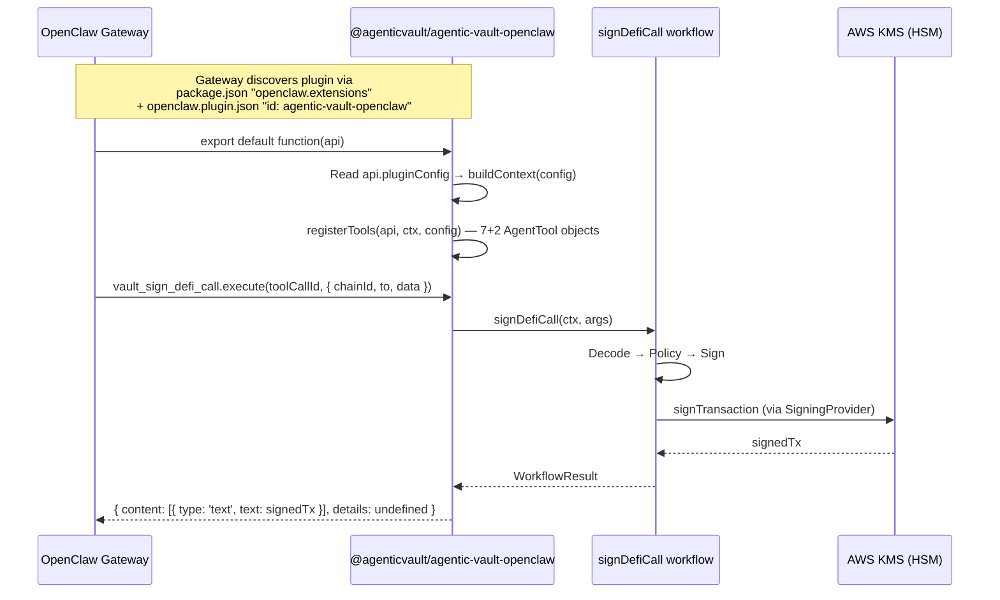

> [← Overview](./0-overview.md) | [Document Index](./0-overview.md#document-index)

### 4.10 OpenClaw Plugin [Phase 8 ✅ → Phase 8.5: SDK Alignment ✅]

> 來源：產品推廣需求 brainstorming（Claude + Codex Nash Equilibrium，2026-02-13）
> ADR-001 Decision 4 修訂：Phase 1 blanket defer → Phase 1.5 controlled launch
> **Phase 8.5 (2026-02-19)**: 從自定義 API 遷移至官方 `openclaw/plugin-sdk` contract

OpenClaw plugin 作為獨立 npm 套件（`@agenticvault/agentic-vault-openclaw`），直接 import workflow layer，不透過 subprocess 或 MCP bridge。

#### Architecture

```
OpenClaw Gateway
  └── @agenticvault/agentic-vault-openclaw (thin adapter)
        ├── import { signDefiCall, signPermit, ... } from '@agenticvault/agentic-vault/protocols'
        ├── import { createSigningProvider, EvmSignerAdapter } from '@agenticvault/agentic-vault'
        ├── import type { OpenClawPluginApi } from 'openclaw/plugin-sdk'
        └── WorkflowContext { signer, policyEngine, auditSink, caller: 'openclaw' }
```

#### File Structure

```
pnpm-workspace.yaml              # packages: ['packages/*']
packages/openclaw-plugin/
├── package.json              # @agenticvault/agentic-vault-openclaw
├── tsconfig.json
├── src/
│   ├── index.ts              # export default function(api) — OpenClaw plugin lifecycle
│   ├── types.ts              # Re-export SDK types + OpenClawPluginConfig
│   ├── tools.ts              # Tool definitions → workflow calls (AgentTool format)
│   └── context.ts            # OpenClaw config → WorkflowContext builder
├── openclaw.plugin.json      # OpenClaw manifest (id + JSON Schema configSchema)
└── test/
    ├── unit/
    │   ├── tools.test.ts
    │   ├── context.test.ts
    │   └── trust-boundary.test.ts
    └── integration/
        ├── plugin-load.test.ts
        └── tool-pipeline.test.ts
```

#### Plugin Entry (SDK-aligned)

```typescript
// packages/openclaw-plugin/src/index.ts
import { type OpenClawPluginApi, type OpenClawPluginConfig } from './types.js';
import { buildContext } from './context.js';
import { registerTools } from './tools.js';

export default function (api: OpenClawPluginApi): void {
  const config = (api.pluginConfig ?? {}) as unknown as OpenClawPluginConfig;
  const ctx = buildContext(config);
  registerTools(api, ctx, config);
}
```

#### Types (SDK re-exports)

```typescript
// packages/openclaw-plugin/src/types.ts
export type { OpenClawPluginApi, AnyAgentTool } from 'openclaw/plugin-sdk';

export interface OpenClawPluginConfig {
  keyId: string;
  region: string;
  expectedAddress?: string;
  policyConfigPath?: string;
  enableUnsafeRawSign?: boolean;
  rpcUrl?: string;
}
```

#### Tool Registration (AgentTool format)

每個 tool 使用官方 `AgentTool` 物件格式，包含 `label` 和 JSON Schema `parameters`：

```typescript
// 範例：vault_get_address
api.registerTool({
  name: 'vault_get_address',
  label: 'Get Vault Address',
  description: 'Get the wallet address managed by this vault',
  parameters: { type: 'object', properties: {}, required: [] },
  async execute(_toolCallId: string, _params: Record<string, unknown>) {
    const result = await getAddressWorkflow(ctx);
    return toResult(result);
  },
} as AnyAgentTool);

// 雙重保護工具使用第二參數 { optional: true }
api.registerTool({ name: 'vault_sign_transaction', ... } as AnyAgentTool, { optional: true });
```

#### Tool Mapping

| OpenClaw Tool | Workflow | Optional | rpcUrl |
| --- | --- | --- | --- |
| `vault_get_address` | `getAddressWorkflow(ctx)` | No | No |
| `vault_health_check` | `healthCheckWorkflow(ctx)` | No | No |
| `vault_sign_defi_call` | `signDefiCall(ctx, 'vault_sign_defi_call', input)` | No | No |
| `vault_sign_permit` | `signPermit(ctx, input)` | No | No |
| `vault_get_balance` | `getBalanceWorkflow(ctx, input)` | No | Yes |
| `vault_send_transfer` | `sendTransfer(ctx, input)` | No | Yes |
| `vault_send_erc20_transfer` | `sendErc20Transfer(ctx, input)` | No | Yes |
| `vault_sign_transaction` | `signer.signTransaction(tx)` | Yes (`{ optional: true }`) | No |
| `vault_sign_typed_data` | `signer.signTypedData(params)` | Yes (`{ optional: true }`) | No |

#### Package Config (gateway discovery)

```json
// package.json (relevant fields)
{
  "openclaw": { "extensions": ["./dist/index.js"] },
  "peerDependencies": {
    "@agenticvault/agentic-vault": "~0.1.1",
    "openclaw": ">=2026.1.0"
  }
}
```

#### Plugin Manifest

```json
// openclaw.plugin.json
{
  "id": "agentic-vault-openclaw",
  "configSchema": {
    "type": "object",
    "properties": {
      "keyId": { "type": "string", "description": "AWS KMS key ID or alias" },
      "region": { "type": "string", "description": "AWS region" },
      "expectedAddress": { "type": "string", "description": "Expected signer address" },
      "policyConfigPath": { "type": "string", "description": "Path to policy JSON file" },
      "enableUnsafeRawSign": { "type": "boolean", "description": "Enable raw signing tools" },
      "rpcUrl": { "type": "string", "description": "JSON-RPC endpoint URL" }
    },
    "required": ["keyId", "region"]
  }
}
```

User configures in OpenClaw config:
```json5
{
  "plugins": {
    "load": {
      "paths": ["/absolute/path/to/node_modules/@agenticvault/agentic-vault-openclaw"]
    },
    "entries": {
      "agentic-vault-openclaw": {
        "enabled": true,
        "config": {
          "keyId": "arn:aws:kms:us-east-1:123:key/xxx",
          "region": "us-east-1",
          "policyConfigPath": "~/.openclaw/vault-policy.json",
          "rpcUrl": "https://eth-mainnet.g.alchemy.com/v2/YOUR_KEY"
        }
      }
    }
  }
}
```

AWS credentials via host's default credential chain（與 CLI/MCP 一致）。

#### Installation Paths

> **v0.1.3 修正**: npm package 已改名為 `@agenticvault/agentic-vault-openclaw`，manifest id 改為 `agentic-vault-openclaw`，unscoped name = manifest id，三種安裝路徑均可正常使用。

| Path | 適用場景 | 狀態 |
| --- | --- | --- |
| `plugins.load.paths` + `plugins.entries.agentic-vault-openclaw` | 本地開發、VM 部署 | ✅ 可用 |
| `openclaw plugins install @agenticvault/agentic-vault-openclaw` | npm 安裝 | ✅ 可用（v0.1.3+） |
| `openclaw plugins install --link ./path` | 本地連結 | ✅ 可用（v0.1.3+） |

#### Security Controls

| Control | Implementation |
| --- | --- |
| Policy engine 強制啟用 | 無 policy config → deny-all default |
| 高風險工具雙重保護 | `vault_sign_transaction`/`vault_sign_typed_data`：`{ optional: true }` + 需 config `enableUnsafeRawSign: true`（與 CLI `--unsafe-raw-sign` 對齊） |
| HSM boundary | Private key never leaves KMS — workflow layer 不接觸私鑰 |
| Audit trail | `caller: 'openclaw'` 標記所有審計日誌 |
| npm provenance | Trusted Publishers (OIDC) + `--provenance` |
| 版本固定 | 文件指引使用者固定 exact version + 禁止 auto-install |

### 4.11 OpenClaw Sequence Diagram [Phase 8 ✅ → 8.5 SDK Alignment ✅]



### Backward Compatibility

| Component | Compatibility |
| --- | --- |
| `PolicyEngine.evaluate(V1Request)` | Works unchanged (intent is optional) |
| `import from './agentic'` | Re-export bridge preserved (deprecated) |
| `sign_swap` MCP tool | Same input schema, enhanced validation |
| `sign_permit` MCP tool | Schema unchanged; Phase 5a adds stricter message-vs-args consistency validation |
| `sign_transaction` / `sign_typed_data` | Unchanged (still unsafe-gated) |
| `ToolContext` | Extended with optional `dispatcher`; `createMcpServer` injects default |
| CLI flags | No new flags required |
| Policy config JSON | V1 configs work as-is (protocol policies optional) |

### Phase 8: OpenClaw Plugin ✅

> 來源：產品推廣需求 brainstorming（Claude + Codex Nash Equilibrium，2026-02-13，Codex threads: `019c5a43-1350-76a1-8ac0-048c1b498173`, `019c5a4d-4abe-7840-b81a-e1212985ee70`）
> ADR-001 Decision 4 修訂：Phase 1 blanket defer → Phase 1.5 controlled launch
> 詳見 [request doc](../requests/2026-02-14-openclaw-plugin.md)

#### 8a. 獨立套件建立 ✅

1. 新增 `pnpm-workspace.yaml`（`packages: ['packages/*']`）
2. 建立 `packages/openclaw-plugin/` 獨立套件（`@agenticvault/agentic-vault-openclaw`）
3. `peerDependencies: { "@agenticvault/agentic-vault": "~0.1.1", "openclaw": ">=2026.1.0" }`
4. 僅 import `@agenticvault/agentic-vault` + `@agenticvault/agentic-vault/protocols` + `openclaw/plugin-sdk` public API
5. Trust boundary test 驗證 import 限制

#### 8b. Tool Registration ✅

1. 實作 7 safe tools: `vault_get_address`, `vault_health_check`, `vault_sign_defi_call`, `vault_sign_permit`, `vault_get_balance`, `vault_send_transfer`, `vault_send_erc20_transfer`
2. 高風險工具雙重保護：`{ optional: true }` + `enableUnsafeRawSign` config flag（與 CLI `--unsafe-raw-sign` 對齊）
3. OpenClaw config schema 驗證 `keyId`, `region` 必填
4. 每個 tool 使用 `AgentTool` 格式（`label` + JSON Schema `parameters` + `execute(toolCallId, params)`）

#### 8c. Context Builder ✅

1. OpenClaw plugin config → `WorkflowContext` 轉換
2. 擴展 `WorkflowCaller` type 加入 `'openclaw'`
3. `caller: 'openclaw'` 審計標記
4. Signer + PolicyEngine factory pattern（每次 `buildContext()` 建立新 instance，caller 自行 cache）
5. AWS credentials via host default chain（不寫入 plugin config）

#### 8d. ADR-001 更新 ✅

1. Decision 4 修訂為 Phase 1.5 controlled launch
2. 更新風險評估（HSM boundary intact, policy engine mitigates prompt injection）
3. 記錄 4 項必要控制（policy 強制、雙重 gating、npm provenance、版本固定指引）

#### 8e. CI + Distribution ✅

1. 新增 `.github/workflows/openclaw-ci.yml`（PR/push 觸發 typecheck + lint + test）
2. 新增 `.github/workflows/release-openclaw.yml`（tag 觸發 npm publish + provenance）
3. npm Trusted Publishers (OIDC) 設定
4. 發布後提交至 OpenClaw 官方 extension 生態系

#### 8.5. OpenClaw SDK Alignment ✅

> 來源：OpenClaw Plugin SDK 對齊 brainstorming（Claude + Codex Nash Equilibrium，2026-02-19，Codex thread: `019c75ca-db6e-7450-a2d5-f69a941a511d`）

1. 入口點從 `export function register(api, config)` 遷移至 `export default function(api)`
2. Config 從第二參數改為 `api.pluginConfig`
3. 自定義 types 替換為 `openclaw/plugin-sdk` SDK types（`OpenClawPluginApi`, `AnyAgentTool`）
4. Tool 註冊從 3-arg `registerTool(name, config, handler)` 遷移至單物件 `registerTool(AgentTool, opts?)`
5. 每個 tool 新增 `label` 欄位、`execute(toolCallId, params)` 簽名
6. Parameters 從 flat `{ required: true }` 遷移至 JSON Schema `{ type: 'object', properties, required }`
7. `openclaw.plugin.json` 從 `name` 改為 `id`，configSchema 改為 JSON Schema
8. `package.json` 新增 `openclaw` peer dep、`"openclaw": { "extensions": [...] }` 欄位
9. Trust boundary 新增 `openclaw/plugin-sdk` 為允許的 import 來源

**v0.1.3 修正**: npm package 已改名為 `@agenticvault/agentic-vault-openclaw`，manifest id 改為 `agentic-vault-openclaw`，unscoped name = manifest id，`openclaw plugins install` 原生可用。詳見 [package rename request](../requests/2026-02-20-openclaw-package-rename.md)。
