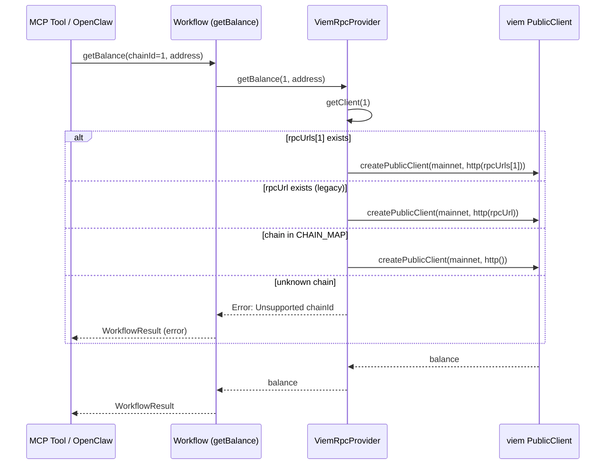

> [← Overview](./0-overview.md) | [Document Index](./0-overview.md#document-index)

### Phase 9: Onboarding Improvements

> 來源：OpenClaw 串接 + 安裝友善度 brainstorming（Claude + Codex Nash Equilibrium，2026-02-14）

#### 9a. Environment Variable Fallback

CLI 和 MCP server 將新增 `VAULT_KEY_ID` / `VAULT_REGION` 環境變數 fallback，減少啟動時必須傳入的 flags：

| 優先順序 | 來源 | 範例 |
| --- | --- | --- |
| 1 | CLI flags / MCP config | `--key-id alias/my-key` |
| 2 | 環境變數 | `VAULT_KEY_ID=alias/my-key` |
| 3 | 無 → 報錯 | Clear error message |

```bash
# 設定一次，後續不需重複傳入
export VAULT_KEY_ID=alias/my-key
export VAULT_REGION=us-east-1
agentic-vault sign --chain-id 1 --to 0x... --data 0x...
```

#### 9b. `.mcp.json` 修復

目前 `.mcp.json.example` 使用 `npx`，但 npm 套件尚未發布。修復為可用的本地開發路徑或確保 npm publish 後 `npx @agenticvault/agentic-vault` 可直接使用。

#### 9c. Policy Template

新增 `policy.example.json` 提供典型 DeFi policy 設定範例：

```json
{
  "allowedChainIds": [1, 11155111],
  "allowedContracts": ["0x...usdc", "0x...uniswap-router"],
  "protocolPolicies": {
    "erc20": { "maxAllowanceWei": "1000000000000" },
    "uniswap_v3": { "maxSlippageBps": 100 }
  }
}
```

#### 9d. `.env.example`

新增 `.env.example` 列出所有支援的環境變數及說明。

### Phase 10: Multi-Chain RPC

> 來源：多鏈 RPC 支援 brainstorming（Claude + Codex Nash Equilibrium，2026-02-20）
> 詳見 [request doc](../requests/2026-02-20-multi-chain-rpc.md)

#### Problem

`ViemRpcProvider` 只接受單一 `rpcUrl`，所有 chain 共用同一 transport。當使用者設定 Sepolia RPC 後查詢 mainnet，產生 `Chain ID mismatch` 錯誤。`WorkflowRpcProvider` interface 已是 per-chain（每個方法的第一參數為 `chainId`），但 `ViemRpcProvider.initClient()` 實作為瓶頸。

#### Solution: A+D Hybrid (4-Level URL Resolution)

```
URL Resolution Priority (per chainId):

rpcUrls[chainId]  →  rpcUrl (legacy)  →  viem public RPC  →  Error
      ①                   ②                    ③               ④
```

| Priority | Source | Condition |
| --- | --- | --- |
| 1 | `rpcUrls[chainId]` | Per-chain URL explicitly configured |
| 2 | `rpcUrl` | Legacy single URL fallback (backward compat) |
| 3 | viem public RPC | Known chain in `CHAIN_MAP` (10 built-in), no explicit URL |
| 4 | Error | Unknown chain + no URL → clear error message |

#### 10a. `ViemRpcProvider` Changes

```typescript
// src/rpc/viem-rpc-provider.ts

export class ViemRpcProvider implements WorkflowRpcProvider {
  private clients = new Map<number, PublicClient>();
  private pending = new Map<number, Promise<PublicClient>>();
  private rpcUrl?: string;
  private rpcUrls: Record<number, string>;           // ← NEW
  private nativeCurrencyOverrides: Record<number, string>;

  constructor(options?: {
    rpcUrl?: string;
    rpcUrls?: Record<number, string>;                 // ← NEW
    nativeCurrencyOverrides?: Record<number, string>;
  }) {
    this.rpcUrl = options?.rpcUrl;
    this.rpcUrls = options?.rpcUrls ?? {};             // ← NEW
    this.nativeCurrencyOverrides = options?.nativeCurrencyOverrides ?? {};
  }

  private async initClient(chainId: number): Promise<PublicClient> {
    const chain = CHAIN_MAP[chainId];

    // 4-level URL resolution
    const resolvedUrl = this.rpcUrls[chainId]         // ① per-chain
      ?? this.rpcUrl                                    // ② legacy fallback
      ?? undefined;                                     // ③④ handled below

    if (!chain && !resolvedUrl) {
      throw new Error(
        `Unsupported chainId ${chainId}. Provide --rpc-urls "${chainId}=<url>" ` +
        `or --rpc-url, or use a supported chain: ${Object.keys(CHAIN_MAP).join(', ')}`,
      );
    }

    const transport = resolvedUrl ? http(resolvedUrl) : http();  // ③ viem public if no URL
    const symbol = this.getNativeCurrencySymbol(chainId);
    const client = createPublicClient({
      chain: chain ?? {
        id: chainId, name: `Chain ${chainId}`,
        nativeCurrency: { name: symbol, symbol, decimals: 18 },
        rpcUrls: { default: { http: [] } },
      },
      transport,
    });

    // Validate chain ID only when explicit URL is provided
    if (resolvedUrl) {
      const remoteChainId = await client.getChainId();
      if (remoteChainId !== chainId) {
        throw new Error(
          `Chain ID mismatch: requested ${chainId} but RPC endpoint returned ${remoteChainId}`,
        );
      }
    }

    return client;
  }
}
```

Key behavior changes:
- **Per-chain clients**: Each `chainId` gets its own `PublicClient` with the correct URL（已有 — `Map<number, PublicClient>`）
- **Validation per URL**: Chain ID mismatch check 僅在有顯式 URL 時執行，public RPC 跳過（viem 自行路由）
- **Backward compat**: 單一 `rpcUrl` 配置者行為不變

#### 10b. Config Surface

##### CLI / MCP Server

```typescript
// src/agentic/cli.ts — parseArgs 新增

case '--rpc-urls':
  rpcUrls = parseRpcUrls(argv[++i]);  // "1=https://...,11155111=https://..."
  break;

// Env fallback
if (!rpcUrls) {
  const envUrls = process.env.VAULT_RPC_URLS;
  if (envUrls) rpcUrls = parseRpcUrls(envUrls);
}
```

```typescript
// Parser helper
function parseRpcUrls(input: string): Record<number, string> {
  const result: Record<number, string> = {};
  for (const pair of input.split(',')) {
    const idx = pair.indexOf('=');
    if (idx === -1) {
      throw new Error(`Invalid --rpc-urls entry (expected chainId=url): "${pair}"`);
    }
    const chainIdStr = pair.slice(0, idx).trim();
    const url = pair.slice(idx + 1).trim();  // preserve full URL including query params with '='
    const chainId = Number(chainIdStr);
    if (!Number.isInteger(chainId) || chainId <= 0) {
      throw new Error(`Invalid chain ID in --rpc-urls: "${chainIdStr}"`);
    }
    if (!url) {
      throw new Error(`Missing URL for chain ${chainId} in --rpc-urls`);
    }
    result[chainId] = url;
  }
  return result;
}
```

Usage:

```bash
# Multi-chain: mainnet + Sepolia + Arbitrum
agentic-vault-mcp --key-id alias/my-key --region us-east-1 \
  --rpc-urls "1=https://eth-mainnet.g.alchemy.com/v2/KEY,11155111=https://eth-sepolia.g.alchemy.com/v2/KEY"

# Single chain (unchanged — backward compat)
agentic-vault-mcp --key-id alias/my-key --region us-east-1 \
  --rpc-url https://eth-mainnet.g.alchemy.com/v2/KEY

# Env vars
export VAULT_RPC_URLS="1=https://...,11155111=https://..."
agentic-vault-mcp --key-id alias/my-key --region us-east-1
```

| Flag / Env | Format | Priority |
| --- | --- | --- |
| `--rpc-urls` | `chainId=url,...` | Highest (flag > env) |
| `VAULT_RPC_URLS` | `chainId=url,...` | Medium |
| `--rpc-url` / `VAULT_RPC_URL` | Single URL | Lowest (legacy fallback) |

##### OpenClaw Plugin Config

```typescript
// packages/openclaw-plugin/src/types.ts

export interface OpenClawPluginConfig {
  keyId: string;
  region: string;
  expectedAddress?: string;
  policyConfigPath?: string;
  enableUnsafeRawSign?: boolean;
  rpcUrl?: string;                       // legacy single URL
  rpcUrls?: Record<string, string>;      // ← NEW: per-chain URLs
}
```

```json
// ~/.openclaw/config.json example
{
  "plugins": {
    "entries": {
      "agentic-vault-openclaw": {
        "config": {
          "keyId": "alias/agentic-vault-signer",
          "region": "ap-northeast-1",
          "rpcUrls": {
            "1": "https://eth-mainnet.g.alchemy.com/v2/KEY",
            "11155111": "https://eth-sepolia.g.alchemy.com/v2/KEY",
            "42161": "https://arb-mainnet.g.alchemy.com/v2/KEY"
          }
        }
      }
    }
  }
}
```

##### OpenClaw Plugin Manifest

```json
// openclaw.plugin.json — configSchema.properties 新增
{
  "configSchema": {
    "properties": {
      "rpcUrls": {
        "type": "object",
        "description": "Per-chain RPC endpoint URLs (key: chain ID string, value: URL)",
        "additionalProperties": { "type": "string" }
      }
    }
  }
}
```

#### 10c. Context Builder Changes

```typescript
// packages/openclaw-plugin/src/context.ts — buildContext

// Convert string keys to number keys + validate
const rpcUrls: Record<number, string> = {};
if (config.rpcUrls) {
  for (const [k, v] of Object.entries(config.rpcUrls)) {
    const chainId = Number(k);
    if (!Number.isInteger(chainId) || chainId <= 0) {
      throw new Error(`Invalid chain ID key in rpcUrls config: "${k}"`);
    }
    if (typeof v !== 'string' || !v.trim()) {
      throw new Error(`Empty or invalid URL for chain ${chainId} in rpcUrls config`);
    }
    rpcUrls[chainId] = v.trim();
  }
}

// Always create provider — matches CLI behavior.
// Without explicit URLs, known chains (10 built-in) still work via viem public RPC.
const rpcProvider = new ViemRpcProvider({
  rpcUrl: config.rpcUrl,
  rpcUrls,
});
```

#### 10d. Sequence Diagram



#### 10e. Test Plan

| Category | Cases |
| --- | --- |
| Resolution: per-chain URL | `rpcUrls[1]` used when available |
| Resolution: legacy fallback | `rpcUrl` used when no per-chain URL |
| Resolution: public RPC | Known chain without any URL → viem default transport |
| Resolution: error | Unknown chain + no URL → clear error |
| Resolution: priority | `rpcUrls[chainId]` overrides `rpcUrl` for same chain |
| Validation: per-chain | Chain ID mismatch check per resolved URL |
| Validation: public skip | No mismatch check for viem public transport |
| Multi-chain: different clients | Chain 1 and chain 11155111 get separate `PublicClient` instances |
| CLI: `--rpc-urls` parsing | Valid format, invalid chainId, missing URL |
| CLI: env fallback | `VAULT_RPC_URLS` parsed correctly |
| CLI: combined | `--rpc-urls` + `--rpc-url` coexist |
| OpenClaw: string keys | JSON object keys (strings) → number keys |
| OpenClaw: rpcUrls only | No `rpcUrl`, only `rpcUrls` → provider created |
| OpenClaw: neither | No `rpcUrl`, no `rpcUrls` → provider created, known chains work via public RPC |
| OpenClaw: invalid key | `rpcUrls: { "abc": "..." }` → validation error |
| Backward compat: rpcUrl only | Existing single-URL config works unchanged |

#### 10f. Security Considerations

| Threat | Mitigation |
| --- | --- |
| Chain ID spoofing via rogue RPC | Chain ID validation per resolved URL（已有機制，per-chain 延伸） |
| Policy bypass via wrong chain | `allowedChainIds` in policy config 不受 RPC 配置影響 |
| RPC URL injection via env | `parseRpcUrls` validates format; URLs are user-configured |
| Credential leak via RPC URL | RPC URLs may contain API keys — 不寫入 audit log（與現行 `rpcUrl` 行為一致） |

#### 10g. Backward Compatibility

| Configuration | Before | After |
| --- | --- | --- |
| `rpcUrl` only | Works | Works（resolution priority ②） |
| No RPC config (CLI) | Known chains work via viem public | Same（resolution priority ③） |
| No RPC config (OpenClaw) | `rpcProvider = undefined` → balance queries fail | `rpcProvider` always created → known chains work（behavior alignment） |
| No RPC config, unknown chain | Error | Same error（resolution priority ④） |
| `rpcUrls` + `rpcUrl` | N/A | `rpcUrls` per-chain override, `rpcUrl` fallback for others |
| `rpcUrls` only | N/A | Per-chain URLs; other chains fall through to public/error |
