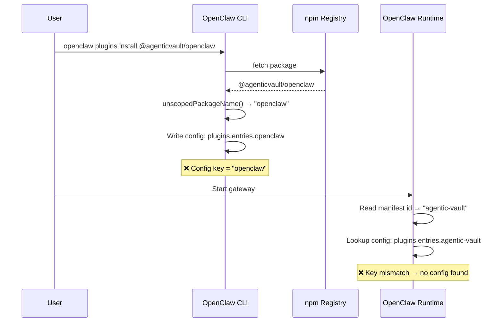

# OpenClaw Package Rename

> **Created**: 2026-02-20
> **Status**: In Progress
> **Priority**: P1
> **Feature**: defi-protocol-integration
> **Depends on**: [2026-02-19-openclaw-install-experience.md](./2026-02-19-openclaw-install-experience.md)
> **Source**: Brainstorming Nash Equilibrium Round 2 (Claude + Codex, Codex thread: `019c7909-276d-7572-a94f-fe3a30ce95c3`)

## Background

OpenClaw installer (`openclaw plugins install`) 從 npm 套件的 unscoped name 推導 extension ID，而非使用 `openclaw.plugin.json` 的 `id` 欄位。這導致：

```
npm package:   @agenticvault/openclaw
unscoped name: openclaw            ← installer 使用
manifest id:   agentic-vault       ← runtime 使用
結果:          openclaw ≠ agentic-vault → config key mismatch
```

### Root Cause Analysis



### Solution: Dual Rename

同時改 npm name 和 manifest id，使兩者一致：

```
改名後:
  npm name:     @agenticvault/agentic-vault-openclaw
  unscoped:     agentic-vault-openclaw
  manifest id:  agentic-vault-openclaw

  unscoped name = manifest id ✅
  → openclaw plugins install 直接可用
```

### 為什麼選 `agentic-vault-openclaw`

| 候選 | unscoped name | 判定 |
|------|--------------|------|
| `@agenticvault/agentic-vault-openclaw` | `agentic-vault-openclaw` | ✅ 與 `context.ts:72`、`tools.ts` 中的 service label 一致 |
| `@agenticvault/vault-openclaw` | `vault-openclaw` | ❌ 新增命名變體，不一致 |
| `@agenticvault/openclaw`（維持） | `openclaw` | ❌ 無法解決 installer mismatch |
| `@agenticvault/agentic-vault`（理想） | `agentic-vault` | ❌ 被主套件佔用 |

### 為什麼現在改

| 條件 | 現況 |
|------|------|
| 版本 | v0.1.2（3 版，2026-02-13 首發） |
| 外部使用者 | 極少 |
| Upstream fix | Pending，時程不可控 |
| 內部 service label | 已用 `agentic-vault-openclaw` |

## Requirements

### R1: Rename npm package (P0)

| Item | Before | After |
|------|--------|-------|
| `package.json` name | `@agenticvault/openclaw` | `@agenticvault/agentic-vault-openclaw` |
| `package.json` version | `0.1.2` | `0.1.3` |
| npm registry | `@agenticvault/openclaw` | deprecate → 指向新套件 |

### R2: Rename manifest id (P0)

| Item | Before | After |
|------|--------|-------|
| `openclaw.plugin.json` id | `agentic-vault` | `agentic-vault-openclaw` |
| Extension dir path | `~/.openclaw/extensions/agentic-vault/` | `~/.openclaw/extensions/agentic-vault-openclaw/` |
| Config key | `plugins.entries.agentic-vault` | `plugins.entries.agentic-vault-openclaw` |

### R3: Update install.ts (P0)

| Item | Before | After |
|------|--------|-------|
| `EXTENSION_ID` | `'agentic-vault'` | `'agentic-vault-openclaw'` |
| npx command | `npx -y -p @agenticvault/openclaw agentic-vault-setup` | `npx -y -p @agenticvault/agentic-vault-openclaw agentic-vault-setup` |
| bin name | `agentic-vault-setup`（不變） | `agentic-vault-setup`（不變） |

### R4: Update READMEs (P0)

5 份 README（en, zh-TW, zh-CN, ja, ko）同步更新：

| Section | Change |
|---------|--------|
| One-Command Install | `npx` 指令更新套件名 |
| Quick Start | `npm install` 指令更新套件名 |
| Tarball | `npm pack` 指令更新套件名 |
| `plugins.load.paths` | 路徑更新 |
| Configuration | config key `agentic-vault` → `agentic-vault-openclaw` |
| Known limitation | 移除或更新（問題已解決） |

### R5: Update CI/CD (P0)

| File | Change |
|------|--------|
| `.github/workflows/openclaw-ci.yml` | filter path + pnpm filter 更新 |
| `.github/workflows/release-openclaw.yml` | npm filter + publish + trusted publisher 更新 |
| `scripts/release.ts` | OPENCLAW_PKG 常數更新 |
| `test/unit/scripts/release.test.ts` | 測試中的套件名更新 |

### R6: Update docs (P1)

所有引用 `@agenticvault/openclaw` 的文件皆需更新。使用 `grep -r "@agenticvault/openclaw" docs/` 掃描確認。

| Scope | Estimated files |
|-------|----------------|
| `docs/features/defi-protocol-integration/` | ~6 files |
| `docs/features/v0-initial-release/` | ~5 files |
| `docs/guides/` | ~3 files |
| `docs/project/adrs/` | ~1 file |
| `CHANGELOG.md` | 1 file |

### R7: npm deprecation + publish (P0)

```bash
# Publish new package
npm publish  # as @agenticvault/agentic-vault-openclaw@0.1.3

# Deprecate old package
npm deprecate @agenticvault/openclaw "Renamed to @agenticvault/agentic-vault-openclaw. See migration guide."
```

### R8: Migration guide (P1)

CHANGELOG.md 新增 v0.1.3 migration section：

```markdown
## 0.1.3 - OpenClaw Plugin Rename

### Breaking Changes

- **Package renamed**: `@agenticvault/openclaw` → `@agenticvault/agentic-vault-openclaw`
- **Extension ID changed**: `agentic-vault` → `agentic-vault-openclaw`
- **Config key changed**: `plugins.entries.agentic-vault` → `plugins.entries.agentic-vault-openclaw`
- **Extension path changed**: `~/.openclaw/extensions/agentic-vault/` → `~/.openclaw/extensions/agentic-vault-openclaw/`

### Migration

1. Update install command: `npm install @agenticvault/agentic-vault-openclaw`
2. Move extension dir: `mv ~/.openclaw/extensions/agentic-vault ~/.openclaw/extensions/agentic-vault-openclaw`
3. Update config key in `~/.openclaw/config.json`
4. (Optional) Re-install via: `npx -y -p @agenticvault/agentic-vault-openclaw agentic-vault-setup`
```

## Scope

| Scope | Description |
|-------|-------------|
| In | npm rename、manifest id rename、install.ts、READMEs、CI/CD、docs、migration guide、npm deprecation |
| Out | 主套件 `@agenticvault/agentic-vault` 不受影響、upstream OpenClaw issue（R3 from install-experience）另行處理 |

## Blast Radius

| Category | Files | Occurrences |
|----------|-------|-------------|
| `@agenticvault/openclaw` references | ~26 | ~110 |
| `extensions/agentic-vault` paths | ~9 | ~53 |
| manifest id `"agentic-vault"` in plugin | ~8 | ~24 |
| **Total estimated** | **~30 unique files** | **~187 occurrences** |

## Related Files

| File | Action |
|------|--------|
| `packages/openclaw-plugin/package.json` | Modify — name + version |
| `packages/openclaw-plugin/openclaw.plugin.json` | Modify — id |
| `packages/openclaw-plugin/src/install.ts` | Modify — EXTENSION_ID + npx command |
| `packages/openclaw-plugin/src/context.ts` | Verify — service label already correct |
| `packages/openclaw-plugin/src/tools.ts` | Verify — service label already correct |
| `packages/openclaw-plugin/test/unit/install.test.ts` | Modify — path assertions |
| `packages/openclaw-plugin/README.md` | Modify — all install sections + config |
| `packages/openclaw-plugin/README.zh-TW.md` | Modify — same |
| `packages/openclaw-plugin/README.zh-CN.md` | Modify — same |
| `packages/openclaw-plugin/README.ja.md` | Modify — same |
| `packages/openclaw-plugin/README.ko.md` | Modify — same |
| `.github/workflows/openclaw-ci.yml` | Modify — filter |
| `.github/workflows/release-openclaw.yml` | Modify — filter + publish |
| `scripts/release.ts` | Modify — constant |
| `test/unit/scripts/release.test.ts` | Modify — assertions |
| `CHANGELOG.md` | Modify — migration guide |
| `docs/features/defi-protocol-integration/2-tech-spec.md` | Modify — references |
| `docs/features/defi-protocol-integration/requests/*.md` | Modify — active requests |
| `docs/guides/*.md` | Modify — references |
| `docs/project/adrs/*.md` | Modify — references |

## Acceptance Criteria

### R1-R3: Core rename
- [ ] `package.json` name = `@agenticvault/agentic-vault-openclaw`
- [ ] `package.json` version = `0.1.3`
- [ ] `openclaw.plugin.json` id = `agentic-vault-openclaw`
- [ ] `install.ts` EXTENSION_ID = `agentic-vault-openclaw`
- [ ] `openclaw plugins install @agenticvault/agentic-vault-openclaw` 正常運作

### R4: READMEs
- [ ] 5 份 README 所有 install 指令、config key、path 已更新
- [ ] Known limitation 已更新或移除

### R5: CI/CD
- [ ] `openclaw-ci.yml` filter + pnpm filter 已更新
- [ ] `release-openclaw.yml` filter + publish 已更新
- [ ] `scripts/release.ts` 常數已更新
- [ ] Release test 已更新

### R6-R8: Docs + Migration
- [ ] `grep -r "@agenticvault/openclaw" docs/guides/ docs/project/` 回傳 0 結果（user-facing docs）
- [ ] `docs/features/` 中的 tech spec 和 active requests 已更新（archive 和歷史 request 不需改）
- [ ] CHANGELOG.md 新增 v0.1.3 migration guide
- [ ] `npm deprecate @agenticvault/openclaw` 已執行（post-publish）

### CI Gates
- [ ] `pnpm build` 成功
- [ ] `pnpm typecheck` 通過
- [ ] `pnpm test:unit` 通過（全倉庫）
- [ ] `pnpm --filter @agenticvault/agentic-vault-openclaw test:unit` 通過

## Risk Assessment

| Risk | Level | Mitigation |
|------|-------|------------|
| npm trusted publisher 需重新設定 | Medium | 提前在 npm 建立新套件的 trusted publisher |
| 遺漏某些 hardcoded 引用 | Medium | `grep -r "@agenticvault/openclaw"` 全倉庫掃描 |
| 外部使用者未察覺 deprecation | Low | npm deprecate message + README migration guide |
| 目錄名稱過長 | Low | `agentic-vault-openclaw` 可接受，與 service label 一致 |

## Progress

| Phase | Status | Note |
|-------|--------|------|
| Analysis | Done | Brainstorm Round 2 Nash Equilibrium |
| Request doc | Done | This document |
| Implementation | In Progress | Code + docs rename |
| npm publish + deprecate | Pending | Post implementation |

## References

- Brainstorm Round 1: Codex thread (oppose → incomplete analysis)
- Brainstorm Round 2: Codex thread `019c7909-276d-7572-a94f-fe3a30ce95c3` (support)
- Install Experience Request: [2026-02-19-openclaw-install-experience.md](./2026-02-19-openclaw-install-experience.md)
- SDK Alignment Request: [2026-02-19-openclaw-sdk-alignment.md](./2026-02-19-openclaw-sdk-alignment.md)
- Parent Request: [2026-02-14-openclaw-plugin.md](./2026-02-14-openclaw-plugin.md)
