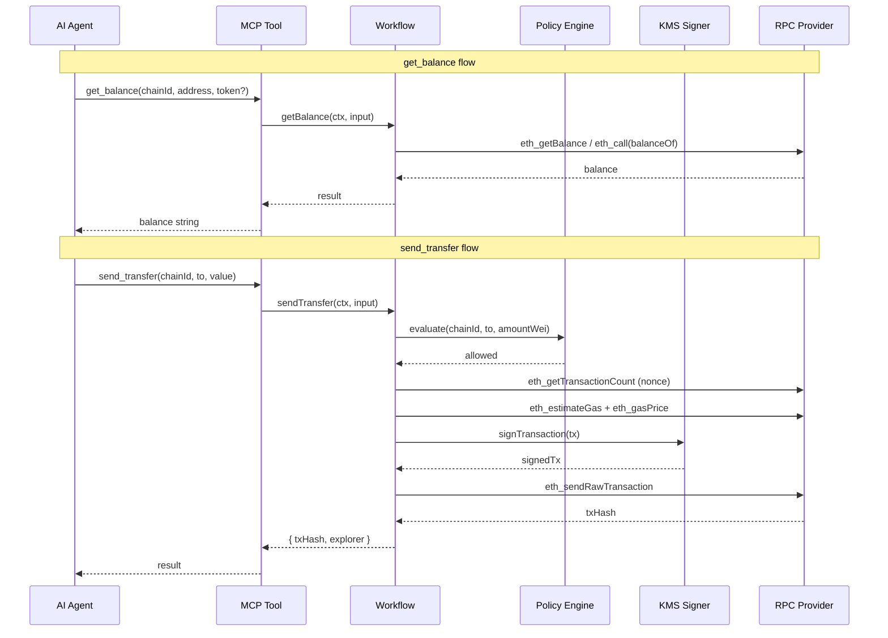

# Native Transfer and Balance Query — Technical Spec

## 1. Requirement Summary

- **Problem**: agentic-vault currently only signs transactions — it has no RPC connectivity for balance queries or transaction broadcasting. Users must manually broadcast signed transactions and cannot query balances through the MCP interface.
- **Goals**: Add `get_balance`, `send_transfer` (native ETH), `send_erc20_transfer` tools to both MCP server and OpenClaw plugin, enabling end-to-end transfer flows directly from an AI agent.
- **Scope**: Balance query (native + ERC20), native ETH transfer, ERC20 transfer. Out of scope: batch transfers, gas estimation tool, cross-chain bridge.

## 2. Existing Code Analysis

### Architecture

```
┌─────────────┐   ┌──────────────────┐   ┌─────────────────┐
│ MCP Tools    │──>│ Protocol Workflows│──>│ Signer (KMS)    │
│ (thin layer) │   │ (business logic)  │   │ (sign only)     │
└─────────────┘   └──────────────────┘   └─────────────────┘
                   │                       │
                   v                       v
              ┌──────────┐          ┌──────────────┐
              │ Policy   │          │ Audit Logger │
              │ Engine   │          └──────────────┘
              └──────────┘
```

### Key Observation

The project deliberately has **no RPC infrastructure** in `src/`. Signing is KMS-only; broadcasting only exists in integration tests (`test/integration/sepolia-*.test.ts`) using viem's `createPublicClient`. This is a design boundary.

### Reusable Components

| Component | Path | Reuse |
|-----------|------|-------|
| ERC20 decoder | `src/protocols/decoders/erc20.ts` | Already decodes `transfer(to, amount)` — selector `0xa9059cbb` |
| Tool registration pattern | `src/agentic/mcp/tools/sign-swap.ts` | Template for new tools |
| Workflow pattern | `src/protocols/workflows/sign-defi-call.ts` | Template for new workflows |
| Shared validators | `src/agentic/mcp/tools/shared.ts` | `zodHexAddress`, `zodPositiveChainId` |
| OpenClaw tool pattern | `packages/openclaw-plugin/src/tools.ts` | Template for OpenClaw registration |

### Files Requiring Changes

| File | Action | Description |
|------|--------|-------------|
| `src/agentic/mcp/tools/get-balance.ts` | New | Balance query tool |
| `src/agentic/mcp/tools/send-transfer.ts` | New | Native ETH transfer tool |
| `src/agentic/mcp/tools/send-erc20-transfer.ts` | New | ERC20 transfer tool |
| `src/agentic/mcp/tools/shared.ts` | Modify | Add `ToolRpcProvider` interface |
| `src/agentic/mcp/tools/index.ts` | Modify | Register new tools |
| `src/agentic/cli.ts` | Modify | Accept `--rpc-url` parameter, create RPC provider |
| `src/protocols/workflows/get-balance.ts` | New | Balance query workflow |
| `src/protocols/workflows/send-transfer.ts` | New | Transfer workflow (sign + broadcast) |
| `src/protocols/workflows/types.ts` | Modify | Add `WorkflowRpcProvider` + new result types |
| `src/protocols/workflows/index.ts` | Modify | Export new workflows |
| `packages/openclaw-plugin/src/tools.ts` | Modify | Register 3 new OpenClaw tools |
| `packages/openclaw-plugin/src/types.ts` | Modify | Extend config with RPC provider |

## 3. Technical Solution

### 3.1 Architecture Design



### 3.2 RPC Provider Interface

New interface injected via `ToolContext` / `WorkflowContext`. Minimal surface — only what's needed:

```typescript
// src/protocols/workflows/types.ts — additions
export interface WorkflowRpcProvider {
  getBalance(chainId: number, address: `0x${string}`): Promise<bigint>;
  getErc20Balance(chainId: number, token: `0x${string}`, address: `0x${string}`): Promise<bigint>;
  getTransactionCount(chainId: number, address: `0x${string}`): Promise<number>;
  estimateGas(chainId: number, tx: { to: `0x${string}`; value?: bigint; data?: `0x${string}` }): Promise<bigint>;
  getGasPrice(chainId: number): Promise<bigint>;
  sendRawTransaction(chainId: number, signedTx: `0x${string}`): Promise<`0x${string}`>;
}

// WorkflowContext — add optional rpcProvider
export interface WorkflowContext {
  // ... existing fields
  rpcProvider?: WorkflowRpcProvider;
}
```

### 3.3 RPC Provider Implementation

Use viem `createPublicClient` with `http` transport. One client per chainId, lazy-created:

```typescript
// src/rpc/viem-rpc-provider.ts
import { createPublicClient, http, type PublicClient } from 'viem';
import { mainnet, sepolia, arbitrum, base, polygon } from 'viem/chains';
import type { WorkflowRpcProvider } from '../protocols/workflows/types.js';

const CHAIN_MAP = { 1: mainnet, 11155111: sepolia, 42161: arbitrum, 8453: base, 137: polygon };
```

**RPC URL resolution** (priority):
1. `--rpc-url <url>` CLI flag (single URL, used for all chains)
2. `--rpc-url-<chainId> <url>` per-chain override
3. Chain default public RPC (from viem chain definitions)

### 3.4 Tool Schemas

#### `get_balance`

```typescript
inputSchema: {
  chainId: zodPositiveChainId,           // required
  address: zodHexAddress.optional(),     // defaults to vault address
  token: zodHexAddress.optional(),       // if provided, query ERC20 balance
}
// Returns: { balance: "1000000000000000000", symbol: "ETH", decimals: 18 }
```

#### `send_transfer`

```typescript
inputSchema: {
  chainId: zodPositiveChainId,           // required
  to: zodHexAddress,                     // recipient
  value: z.string(),                     // amount in wei (decimal string)
}
// Returns: { txHash: "0x...", explorerUrl: "https://..." }
```

#### `send_erc20_transfer`

```typescript
inputSchema: {
  chainId: zodPositiveChainId,           // required
  token: zodHexAddress,                  // ERC20 contract address
  to: zodHexAddress,                     // recipient
  amount: z.string(),                    // amount in token smallest unit (decimal string)
}
// Returns: { txHash: "0x...", explorerUrl: "https://..." }
```

### 3.5 Core Logic

#### `send_erc20_transfer` — Reuse Existing Decoder

ERC20 `transfer(address,uint256)` is already decoded by `erc20Decoder` (selector `0xa9059cbb`). The `send_erc20_transfer` tool builds calldata via `encodeFunctionData` and delegates to a transfer workflow that:

1. Encodes `transfer(to, amount)` calldata
2. Passes through policy engine (reuses existing ERC20 evaluator)
3. Builds full transaction (nonce, gas, chainId)
4. Signs via KMS
5. Broadcasts via RPC provider
6. Returns txHash

#### `send_transfer` — Native ETH

Simpler path: no calldata, just `{ to, value, chainId }`. Policy evaluates `amountWei` against limits. No decoder needed.

### 3.6 Explorer URL Mapping

```typescript
const EXPLORER: Record<number, string> = {
  1: 'https://etherscan.io',
  11155111: 'https://sepolia.etherscan.io',
  42161: 'https://arbiscan.io',
  8453: 'https://basescan.org',
  137: 'https://polygonscan.com',
};
```

## 4. Risks and Dependencies

| Risk | Impact | Mitigation |
|------|--------|-----------|
| RPC provider adds external dependency | Medium | Interface-based; viem provider is injectable, testable with mocks |
| Gas estimation may fail on some chains | Low | Fallback to manual gas limit; return clear error |
| Nonce management under concurrent use | Medium | Use `pending` nonce from RPC; warn in docs about concurrent signing |
| Trust boundary: RPC is new external I/O | High | `WorkflowRpcProvider` interface lives in `src/protocols/`; viem implementation in `src/rpc/` (not in `src/agentic/`) |
| Breaking change to `ToolContext` | Low | `rpcProvider` is optional; existing tools unaffected |

## 5. Work Breakdown

| # | Task | Estimate | Dependencies |
|---|------|----------|-------------|
| 1 | Add `WorkflowRpcProvider` interface to `types.ts` | S | - |
| 2 | Implement `ViemRpcProvider` in `src/rpc/` | M | 1 |
| 3 | Add `--rpc-url` to CLI parser | S | - |
| 4 | `getBalance` workflow + `get_balance` MCP tool | M | 1, 2 |
| 5 | `sendTransfer` workflow + `send_transfer` MCP tool | L | 1, 2 |
| 6 | `sendErc20Transfer` workflow + `send_erc20_transfer` MCP tool | M | 1, 2, 5 |
| 7 | OpenClaw: register 3 new tools | M | 4, 5, 6 |
| 8 | Unit tests for all new tools + workflows | L | 4, 5, 6, 7 |
| 9 | Integration test: Sepolia self-transfer | M | 5 |

**Size**: S = < 1hr, M = 1-3hr, L = 3-6hr

## 6. Testing Strategy

| Layer | Scope | Mock |
|-------|-------|------|
| Unit | `getBalance` workflow — mock RPC provider | `WorkflowRpcProvider` mock |
| Unit | `sendTransfer` workflow — mock signer + RPC + policy | All mocked |
| Unit | `sendErc20Transfer` workflow — mock signer + RPC + policy | All mocked |
| Unit | MCP tool registration + input validation | Zod schema validation |
| Unit | OpenClaw tool registration | Mock API |
| Integration | Sepolia self-transfer (ETH) | Real KMS + RPC |
| Integration | Sepolia ERC20 transfer | Real KMS + RPC |

Coverage target: > 80% lines + branches.

## 7. Decisions (Resolved)

| # | Question | Decision | Rationale |
|---|----------|----------|-----------|
| 1 | `get_balance` require `--rpc-url` or default to public RPCs? | B) Default to public RPCs via viem chain definitions; `--rpc-url` overrides (MCP server). OpenClaw requires explicit `rpcUrl` in plugin config. | Better UX for MCP; OpenClaw keeps explicit config for safety |
| 2 | Transfer tools wait for receipt or return after broadcast? | A) Return txHash immediately after `sendRawTransaction` | Lower latency; agent can poll separately if needed |
| 3 | Add `send_batch_transfer`? | B) Out of scope | Single transfers cover the primary use case |
| 4 | ERC20 decimals: human-readable or smallest unit? | A) Smallest unit only | Simpler, no extra RPC call; agent handles formatting |
