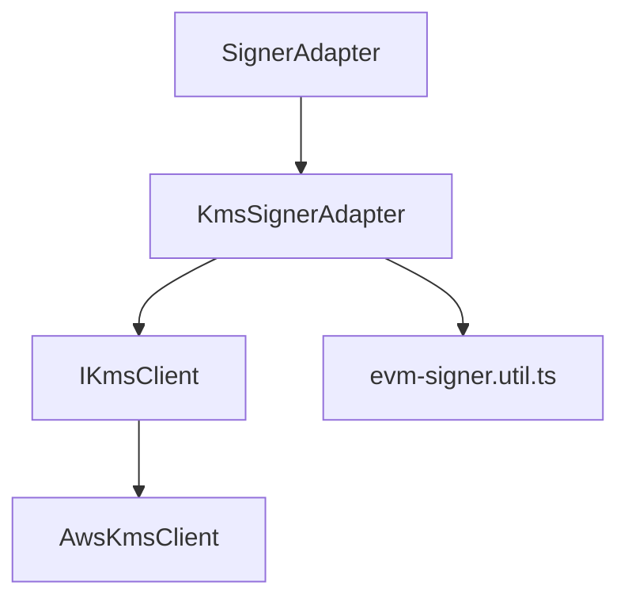
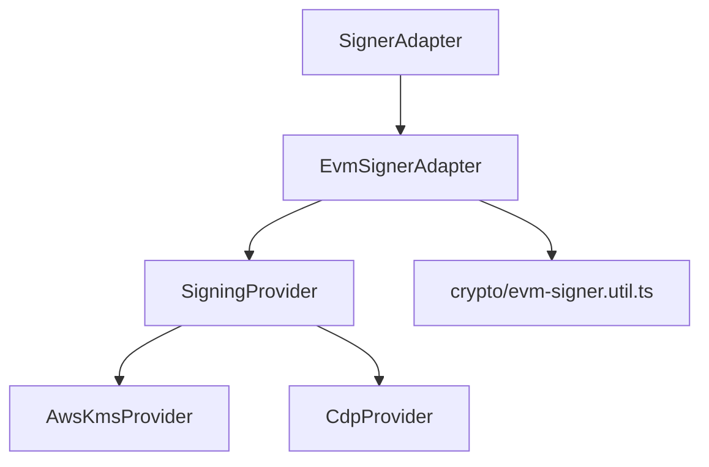
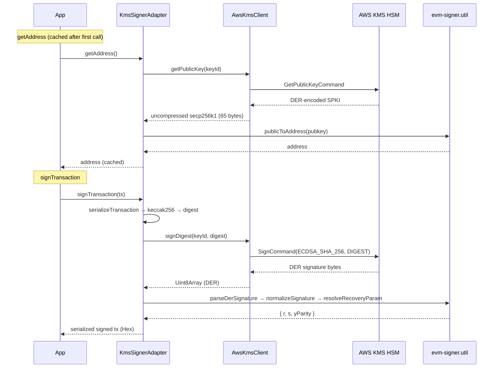

# Signer — Technical Spec

> **Status**: Superseded
> **Superseded by**: Actual implementation in `src/core/`, `src/providers/`, `src/provider/`
> **Note**: This document was written for the original `@sd0xdev/vaultsign` extraction. The Provider Abstraction Layer (v0.2.1) and subpath exports described in sections 3.2-3.3 have been **implemented**. Refer to the actual codebase for current architecture.

## 1. Overview

`@sd0xdev/vaultsign`：伺服器端 EVM 簽名套件，目前僅支援 AWS KMS provider。未來規劃可插拔的 `SigningProvider` 抽象。

- v0.2.0：AWS KMS provider（目前）
- v0.3.0（規劃中）：`SigningProvider` 抽象化 + CDP provider

> API 使用方式見 [README](../README.md)

### 演進路線

| Version | PR | 範圍 |
|---------|-----|------|
| v0.2.0 | PR1 | `kms-signer` → `vaultsign` 改名，API 不變 |
| v0.2.1 | PR2 | 引入 `SigningProvider`，AWS 移至 `providers/aws-kms/` |
| v0.3.0 | PR3 | 新增 `providers/cdp/`，subpath exports |
| — | PR4 | 選擇性：`@sd0xdev/aws-kms-evm-signer` re-export shim |

## 2. Interface

> Source: [`types.ts`](../src/types.ts)

| Method | Description |
|--------|-------------|
| `getAddress()` | 從 KMS public key 推導 Ethereum address（快取） |
| `signTransaction(tx)` | 序列化 → keccak256 → KMS sign → DER decode → assemble signed tx |
| `signTypedData(params)` | EIP-712 typed data hash → KMS sign → 回傳 `{v, r, s}` |
| `healthCheck()` | `DescribeKey` 驗證 KeySpec/KeyState/KeyUsage + address 比對 |

**Design decisions**:
- `signTypedData` 回傳 `{v, r, s}` 而非 `Hex`——EIP-2612 `selfPermit(token, value, deadline, v, r, s)` 需要分開元件
- `v` 值為 `27`/`28`（legacy recovery id = yParity + 27）

### Public Exports

> Source: [`index.ts`](../src/index.ts)

| Export | Kind | Source |
|--------|------|--------|
| `KmsSignerAdapter` | class | `kms-signer.ts` |
| `KmsSignerConfig` | type | `kms-signer.ts` |
| `AwsKmsClient` | class | `kms-client.ts` |
| `IKmsClient` | type | `kms-client.ts` |
| `KmsKeyMetadata` | type | `kms-client.ts` |
| `SignerAdapter` | type | `types.ts` |
| `SignatureComponents` | type | `types.ts` |
| `SignTypedDataParams` | type | `types.ts` |
| `parseDerSignature` | function | `evm-signer.util.ts` |
| `parseDerPublicKey` | function | `evm-signer.util.ts` |
| `normalizeSignature` | function | `evm-signer.util.ts` |
| `resolveRecoveryParam` | function | `evm-signer.util.ts` |
| `publicToAddress` | function | `evm-signer.util.ts` |

## 3. Architecture

### 3.1 現行結構（v0.2.0）

> Source: [`src/`](../src/)

```
src/
├── index.ts              # Barrel re-exports
├── types.ts              # SignerAdapter interface
├── kms-client.ts         # IKmsClient + AwsKmsClient
├── kms-signer.ts         # KmsSignerAdapter（orchestration）
└── evm-signer.util.ts    # DER parsing, low-s, recovery（pure functions）
```



| Layer | File | Responsibility |
|-------|------|---------------|
| Interface | [`types.ts`](../src/types.ts) | `SignerAdapter` 合約 |
| KMS Client | [`kms-client.ts`](../src/kms-client.ts) | Provider-agnostic KMS 抽象 |
| Orchestration | [`kms-signer.ts`](../src/kms-signer.ts) | 組裝 tx → sign → assemble |
| Utilities | [`evm-signer.util.ts`](../src/evm-signer.util.ts) | DER parse / low-s / recovery |

### 3.2 Target Architecture（PR2: v0.2.1）— 尚未實作

```
src/
├── index.ts
├── types.ts
├── core/
│   ├── signing-provider.ts      # SigningProvider + SignatureBlob/PublicKeyBlob
│   └── evm-signer-adapter.ts    # EVM 編排層
├── providers/
│   └── aws-kms/
│       ├── index.ts
│       ├── aws-kms-provider.ts  # implements SigningProvider
│       └── aws-kms-client.ts
└── crypto/
    └── evm-signer.util.ts
```



#### SigningProvider 介面設計

| 決策 | 說明 |
|------|------|
| 回傳原始位元組 | `SignatureBlob{bytes, encoding, algorithm}`，EVM 解析由 adapter 層處理 |
| 鏈無關 | `algorithm` 欄位預留 ed25519 等非 EVM 演算法 |
| 無 `keyId` 參數 | Provider 建構時綁定 key |
| 與 `IKmsClient` 差異 | `IKmsClient` 每次呼叫需 `keyId`；`SigningProvider` 已封裝 key |

### 3.3 Subpath Exports（PR3: v0.3.0）— 尚未實作

```jsonc
// package.json exports
{
  ".": "./src/index.ts",
  "./aws-kms": "./src/providers/aws-kms/index.ts",
  "./cdp": "./src/providers/cdp/index.ts"
}
```

## 4. AWS KMS Sign Flow



### Utility Functions

> Source: [`evm-signer.util.ts`](../src/evm-signer.util.ts)

| Function | Purpose |
|----------|---------|
| `parseDerSignature` | 從 DER 提取 r, s |
| `parseDerPublicKey` | 從 DER SPKI 提取 uncompressed pubkey |
| `normalizeSignature` | Low-s normalization (EIP-2) |
| `resolveRecoveryParam` | 嘗試 yParity 0/1 找到正確值 |
| `publicToAddress` | Uncompressed pubkey → keccak256 → address |
| `bytesToBigInt` | Uint8Array → bigint（internal helper，供 normalizeSignature 使用） |
| `bigIntTo32Bytes` | bigint → 32-byte Uint8Array（internal helper，供 normalizeSignature 使用） |

## 5. Config

```typescript
signer: z.object({
  keyId: z.string(),
  region: z.string().default('ap-northeast-1'),
  expectedAddress: z.string().regex(/^0x[0-9a-fA-F]{40}$/).optional(),
}),
```

**為何移除 local signer**：DCA 非高頻（KMS ~50-200ms 可接受），統一簽名路徑避免 DER/low-s/v-recovery 行為差異。開發者建立個人 KMS key，cost ~$1/month。

## 6. Dev/Test

### KMS Key 設定

```bash
aws kms create-key \
  --key-spec ECC_SECG_P256K1 \
  --key-usage SIGN_VERIFY \
  --description "DCA executor dev signer" \
  --region ap-northeast-1
```

### IAM Policy（最小權限）

```json
{
  "Version": "2012-10-17",
  "Statement": [{
    "Effect": "Allow",
    "Action": ["kms:Sign", "kms:GetPublicKey", "kms:DescribeKey"],
    "Resource": "arn:aws:kms:ap-northeast-1:ACCOUNT:key/KEY_ID"
  }]
}
```

### Credential 策略

| 環境 | Credential 來源 |
|------|-----------------|
| Local dev | `AWS_ACCESS_KEY_ID` + `AWS_SECRET_ACCESS_KEY` + optional `AWS_SESSION_TOKEN` |
| CI | GitHub Actions OIDC → `AssumeRoleWithWebIdentity` |
| Production | IAM role / instance profile |

### Tests

| Suite | Source | Description |
|-------|--------|-------------|
| Unit: util | [`test/unit/evm-signer.util.test.ts`](../test/unit/evm-signer.util.test.ts) | DER parse, low-s, recovery（26 tests） |
| Unit: signer | [`test/unit/kms-signer.test.ts`](../test/unit/kms-signer.test.ts) | Orchestration — mock KMS（23 tests） |
| Unit: client | [`test/unit/kms-client.test.ts`](../test/unit/kms-client.test.ts) | AwsKmsClient — mock AWS SDK（11 tests） |
| Integration | [`test/integration/aws-kms.test.ts`](../test/integration/aws-kms.test.ts) | 真實 KMS sign → recover → address match（11 tests） |

## 7. Risks

| Risk | Prob. | Mitigation |
|------|:-----:|-----------|
| ~~KMS 簽 EIP-712~~ | — | ✅ 已驗證——integration test 確認 |
| KMS DER 解碼 bug | Low | 借鑑 wallet-provider 實作 + pure function unit test |
| 開發者 KMS 設定門檻 | Low | Setup script + IAM policy template |
| PR2 breaking change | Medium | 保留 `KmsSignerAdapter` 為 `@deprecated` 別名 |
| CDP v2 API 不穩定 | Medium | CDP provider 獨立子路徑 |
| 多 provider SDK 膨脹 | Low | subpath exports，使用者只裝需要的 provider |

## 8. Dependencies

### 現有（v0.2.0）

| Package | Purpose | 版本 |
|---------|---------|------|
| `@aws-sdk/client-kms` | AWS KMS signing + public key | ^3.x |
| `viem` | Tx serialization, keccak256, address | ^2.x |

### 規劃中（v0.3.0）

| Package | Purpose | 版本 |
|---------|---------|------|
| `@coinbase/cdp-sdk` | CDP v2 Server Wallet | ^0.x |

## 9. References

- [Project Tech Spec](../../../docs/2-tech-spec.md)
- [Project Architecture](../../../docs/3-architecture.md)
- [Routing Spec](../../../docs/features/routing/2-tech-spec.md) — permit 使用 `signTypedData`
- [Coinbase CDP v2 Docs](https://docs.cdp.coinbase.com/server-wallets/v2/introduction/welcome)
- wallet-provider 借鑑：`onekey/server-service-onchain/src/service/gas-account/wallet-provider/`
