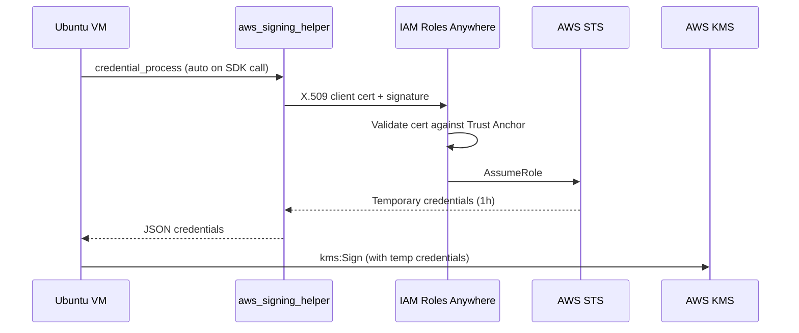

# IAM Roles Anywhere Setup

End-to-end guide for deploying Agentic Vault on a non-AWS VM (Ubuntu) using IAM Roles Anywhere. No long-lived AWS credentials on the VM.

## Architecture



## Prerequisites

| Tool | Where | Purpose |
|------|-------|---------|
| AWS CLI + SSO profile | Dev machine | Create AWS resources |
| OpenSSL | Dev machine | Generate CA + client cert |
| `op` CLI (optional) | Dev machine | Store CA key in 1Password |
| AWS CLI v2 | VM | Verify credentials (`aws sts get-caller-identity`) |
| `aws_signing_helper` | VM | Exchange cert for credentials |
| Node.js 24+ | VM | Run agentic-vault |

## Overview

Work is split between dev machine (has AWS access) and VM (production, no AWS credentials).

| Step | Where | What |
|------|-------|------|
| 1 | Dev | Create KMS key |
| 2 | Dev | Create CA + sign client cert |
| 3 | Dev | Store CA key securely |
| 4 | Dev | Create Trust Anchor, IAM Role, Profile |
| 5 | Dev | Transfer client cert + key to VM |
| 6 | VM | Install tools + deploy cert |
| 7 | VM | Configure AWS profile + start MCP server |

---

## Dev Machine Steps

### Step 1: Create KMS Key

```bash
# Login to AWS (if SSO)
aws sso login --profile YOUR_PROFILE
export AWS_PROFILE=YOUR_PROFILE

# Create ECC secp256k1 key
aws kms create-key \
  --key-spec ECC_SECG_P256K1 \
  --key-usage SIGN_VERIFY \
  --description "Agentic Vault EVM signing key" \
  --region REGION

# Create alias (note the key ID from output above)
aws kms create-alias \
  --alias-name alias/agentic-vault-signer \
  --target-key-id KEY_ID \
  --region REGION
```

### Step 2: Create CA + Client Certificate

Use a self-signed OpenSSL CA (free, sufficient for Roles Anywhere). AWS Private CA (~$400/month) is not required.

```bash
mkdir -p ~/rolesanywhere-ca && cd ~/rolesanywhere-ca

# CA key + self-signed cert (10 years)
# IMPORTANT: -addext "basicConstraints=critical,CA:TRUE" is required
openssl genrsa -out ca.key 4096
openssl req -new -x509 -days 3650 -key ca.key \
  -out ca.pem \
  -subj "/CN=AgenticVault RolesAnywhere CA/O=YourOrg" \
  -addext "basicConstraints=critical,CA:TRUE" \
  -addext "keyUsage=critical,keyCertSign,cRLSign"

# Client key + cert (1 year)
# IMPORTANT: -extfile is required for Roles Anywhere to trust the cert
cat > client-ext.cnf << 'EXTEOF'
basicConstraints = CA:FALSE
keyUsage = critical, digitalSignature
extendedKeyUsage = clientAuth
EXTEOF

openssl genrsa -out client.key 2048
openssl req -new -key client.key -out client.csr \
  -subj "/CN=agentic-vault-vm/O=YourOrg"
openssl x509 -req -days 365 \
  -in client.csr -CA ca.pem -CAkey ca.key -CAcreateserial \
  -extfile client-ext.cnf \
  -out client.crt
rm client-ext.cnf

# Verify
openssl verify -CAfile ca.pem client.crt
openssl x509 -in client.crt -noout -text | grep -A1 "Key Usage"
```

> **Gotcha 1**: Without `basicConstraints=critical,CA:TRUE` on the CA cert, the Trust Anchor creation will fail with `Incorrect basic constraints for CA certificate`.
>
> **Gotcha 2**: Without `keyUsage: digitalSignature` + `extendedKeyUsage: clientAuth` on the client cert, Roles Anywhere will reject with `Untrusted certificate. Insufficient certificate`.

### Step 3: Store CA Key Securely

The CA key can sign new client certs, so it must not stay on disk.

**Option A: 1Password (`op` CLI)**

```bash
op item create \
  --category "Secure Note" \
  --title "AgenticVault RolesAnywhere CA Key" \
  --tags "aws,agentic-vault" \
  "notesPlain=$(cat ca.key)"

# Delete from disk
rm ca.key
```

To retrieve later (e.g., for cert renewal):

```bash
op item get "AgenticVault RolesAnywhere CA Key" \
  --fields notesPlain --format json \
  | python3 -c "import sys,json; print(json.load(sys.stdin)['value'])" \
  > ca.key
chmod 400 ca.key
```

**Option B: Encrypted USB / offline storage**

```bash
cp ca.key /Volumes/SECURE_USB/
rm ca.key
```

### Step 4: Create AWS Roles Anywhere Resources

```bash
export AWS_PROFILE=YOUR_PROFILE

# 4a. Trust Anchor
python3 -c "
import json
cert = open('$HOME/rolesanywhere-ca/ca.pem').read()
d = {
  'name': 'agentic-vault-anchor',
  'source': {
    'sourceType': 'CERTIFICATE_BUNDLE',
    'sourceData': { 'x509CertificateData': cert }
  }
}
json.dump(d, open('/tmp/trust-anchor.json','w'))
"

aws rolesanywhere create-trust-anchor \
  --cli-input-json file:///tmp/trust-anchor.json \
  --region REGION

# Enable it (created disabled by default)
aws rolesanywhere enable-trust-anchor \
  --trust-anchor-id TA_ID \
  --region REGION
```

```bash
# 4b. IAM Role
TA_ARN="arn:aws:rolesanywhere:REGION:ACCOUNT:trust-anchor/TA_ID"

cat > /tmp/trust-policy.json << EOF
{
  "Version": "2012-10-17",
  "Statement": [{
    "Effect": "Allow",
    "Principal": { "Service": "rolesanywhere.amazonaws.com" },
    "Action": ["sts:AssumeRole", "sts:TagSession", "sts:SetSourceIdentity"],
    "Condition": {
      "StringEquals": { "aws:SourceAccount": "ACCOUNT" },
      "ArnEquals": { "aws:SourceArn": "${TA_ARN}" }
    }
  }]
}
EOF

aws iam create-role \
  --role-name agentic-vault-signer \
  --assume-role-policy-document file:///tmp/trust-policy.json
```

```bash
# 4c. KMS permissions
KMS_KEY_ARN="arn:aws:kms:REGION:ACCOUNT:key/KEY_ID"

cat > /tmp/kms-policy.json << EOF
{
  "Version": "2012-10-17",
  "Statement": [{
    "Effect": "Allow",
    "Action": ["kms:Sign", "kms:GetPublicKey", "kms:DescribeKey"],
    "Resource": "${KMS_KEY_ARN}"
  }]
}
EOF

aws iam put-role-policy \
  --role-name agentic-vault-signer \
  --policy-name kms-sign \
  --policy-document file:///tmp/kms-policy.json
```

```bash
# 4d. Roles Anywhere Profile
ROLE_ARN=$(aws iam get-role --role-name agentic-vault-signer \
  --query "Role.Arn" --output text)

aws rolesanywhere create-profile \
  --name "agentic-vault-profile" \
  --role-arns "${ROLE_ARN}" \
  --region REGION

# Enable it
aws rolesanywhere enable-profile \
  --profile-id PROFILE_ID \
  --region REGION
```

```bash
# 4e. Clean up temp files
rm -f /tmp/trust-anchor.json /tmp/trust-policy.json /tmp/kms-policy.json
```

### Step 5: Transfer to VM

```bash
# Record ARNs for VM config
echo "TA_ARN:      arn:aws:rolesanywhere:REGION:ACCOUNT:trust-anchor/TA_ID"
echo "PROFILE_ARN: arn:aws:rolesanywhere:REGION:ACCOUNT:profile/PROFILE_ID"
echo "ROLE_ARN:    arn:aws:iam::ACCOUNT:role/agentic-vault-signer"

# Transfer client cert + key securely (never ca.key)
# Use scp with restrictive permissions on the remote side
scp ~/rolesanywhere-ca/client.crt user@VM_IP:/tmp/
scp ~/rolesanywhere-ca/client.key user@VM_IP:/tmp/
# On VM immediately: move to secure location (see Step 6)
```

---

## VM Steps

### Step 6: Install Tools + Deploy Cert

```bash
# Node.js 24
curl -fsSL https://deb.nodesource.com/setup_24.x | sudo -E bash -
sudo apt install -y nodejs

# Agentic Vault (openclaw is optional — only if using OpenClaw plugin)
npm install -g @agenticvault/agentic-vault
# npm install -g @agenticvault/openclaw  # optional

# AWS CLI v2 (required for verification; not pre-installed on Ubuntu)
# See Gotcha 5 in Troubleshooting if `aws` command not found
ARCH=$(uname -m)  # aarch64 or x86_64
if [ "$ARCH" = "aarch64" ]; then CLI_ARCH="aarch64"; else CLI_ARCH="x86_64"; fi
curl -fsSL "https://awscli.amazonaws.com/awscli-exe-linux-${CLI_ARCH}.zip" -o /tmp/awscliv2.zip
sudo apt install -y unzip
unzip -q /tmp/awscliv2.zip -d /tmp/
sudo /tmp/aws/install
rm -rf /tmp/awscliv2.zip /tmp/aws

# AWS credential helper
# IMPORTANT: URL path is case-sensitive. Use exact casing below.
#   x86_64  → .../X86_64/Linux/Amzn2023/aws_signing_helper
#   aarch64 → .../Aarch64/Linux/Amzn2023/aws_signing_helper
# See Gotcha 3 in Troubleshooting if you get XML instead of a binary.
if [ "$ARCH" = "aarch64" ]; then
  HELPER_URL="https://rolesanywhere.amazonaws.com/releases/1.7.3/Aarch64/Linux/Amzn2023/aws_signing_helper"
else
  HELPER_URL="https://rolesanywhere.amazonaws.com/releases/1.7.3/X86_64/Linux/Amzn2023/aws_signing_helper"
fi
curl -Lo /tmp/aws_signing_helper "$HELPER_URL"

# Verify it's actually a binary (not XML error page)
file /tmp/aws_signing_helper | grep -q "ELF" || { echo "ERROR: downloaded file is not a binary"; exit 1; }

sudo install -m 755 /tmp/aws_signing_helper /usr/local/bin/
rm /tmp/aws_signing_helper

# Deploy client cert (move out of /tmp immediately)
# IMPORTANT: key must be readable by the user running agentic-vault
sudo mkdir -p /etc/pki/rolesanywhere
sudo install -m 444 /tmp/client.crt /etc/pki/rolesanywhere/client.crt
sudo install -m 440 /tmp/client.key /etc/pki/rolesanywhere/client.key
sudo chown root:$(id -gn) /etc/pki/rolesanywhere/client.key
rm /tmp/client.crt /tmp/client.key
```

### Step 7: Configure + Start

```bash
# Replace with actual ARNs from Step 5
TA_ARN="arn:aws:rolesanywhere:REGION:ACCOUNT:trust-anchor/TA_ID"
PROFILE_ARN="arn:aws:rolesanywhere:REGION:ACCOUNT:profile/PROFILE_ID"
ROLE_ARN="arn:aws:iam::ACCOUNT:role/agentic-vault-signer"

# Write AWS config
# IMPORTANT: credential_process MUST be a single line — backslash continuations break AWS SDK parsing
mkdir -p ~/.aws
cat >> ~/.aws/config << EOF

[profile rolesanywhere-kms]
region = REGION
credential_process = /usr/local/bin/aws_signing_helper credential-process --certificate /etc/pki/rolesanywhere/client.crt --private-key /etc/pki/rolesanywhere/client.key --trust-anchor-arn ${TA_ARN} --profile-arn ${PROFILE_ARN} --role-arn ${ROLE_ARN}
EOF

# Verify credentials work (end-to-end via SDK profile)
AWS_PROFILE=rolesanywhere-kms aws sts get-caller-identity

# Start MCP server
AWS_PROFILE=rolesanywhere-kms agentic-vault-mcp \
  --key-id alias/agentic-vault-signer \
  --region REGION
```

---

## Security Checklist

| Item | Requirement |
|------|------------|
| CA key | Stored in 1Password / offline. Never on VM. |
| Client key | `/etc/pki/rolesanywhere/client.key` with `chmod 440`, owned by `root:<app-group>` |
| Trust policy | `SourceAccount` + `ArnEquals` locks to specific Trust Anchor |
| IAM permissions | Minimum: `kms:Sign`, `kms:GetPublicKey`, `kms:DescribeKey` only |
| Session duration | Default 1h. Configurable 15min-12h via Profile settings. |
| Cert renewal | Client cert expires in 1 year. Renew with CA key from 1Password. |

## Cert Renewal (Annual)

```bash
# On dev machine: retrieve CA key
op item get "AgenticVault RolesAnywhere CA Key" \
  --fields notesPlain --format json \
  | python3 -c "import sys,json; print(json.load(sys.stdin)['value'])" \
  > ca.key && chmod 400 ca.key

# Sign new client cert (must include extensions)
cat > client-ext.cnf << 'EXTEOF'
basicConstraints = CA:FALSE
keyUsage = critical, digitalSignature
extendedKeyUsage = clientAuth
EXTEOF

openssl genrsa -out client.key 2048
openssl req -new -key client.key -out client.csr \
  -subj "/CN=agentic-vault-vm/O=YourOrg"
openssl x509 -req -days 365 \
  -in client.csr -CA ca.pem -CAkey ca.key -CAcreateserial \
  -extfile client-ext.cnf \
  -out client.crt
rm client-ext.cnf

# Transfer to VM
scp client.crt client.key user@VM_IP:/tmp/

# On VM: replace certs and restart
sudo install -m 444 /tmp/client.crt /etc/pki/rolesanywhere/client.crt
sudo install -m 440 /tmp/client.key /etc/pki/rolesanywhere/client.key
sudo chown root:$(id -gn) /etc/pki/rolesanywhere/client.key
rm /tmp/client.crt /tmp/client.key
# Restart MCP server

# Delete CA key from disk
rm ca.key
```

## Troubleshooting

### Certificate Issues

| Problem | Cause | Fix |
|---------|-------|-----|
| `Incorrect basic constraints` | CA cert missing `CA:TRUE` | Regenerate CA with `-addext "basicConstraints=critical,CA:TRUE"` |
| `Untrusted certificate. Insufficient certificate` | Client cert missing extensions | Re-sign with `-extfile` containing `keyUsage: digitalSignature` + `extendedKeyUsage: clientAuth` |
| `unable to parse private key` | Key file has `400` owned by root; non-root user can't read | `sudo chmod 440` + `sudo chown root:<your-group>` on the key file |
| Cert expired | Client cert > 1 year old | See Cert Renewal section above |

### AWS Roles Anywhere

| Problem | Cause | Fix |
|---------|-------|-----|
| `Trust anchor is disabled` | Not enabled after creation | `aws rolesanywhere enable-trust-anchor --trust-anchor-id TA_ID` |
| `Profile is disabled` | Not enabled after creation | `aws rolesanywhere enable-profile --profile-id PROFILE_ID` |
| `Access denied` on KMS | Role missing permissions | Check `kms:Sign` in inline policy, verify KMS key ARN |
| `credential_process` fails | Wrong cert path or ARN | Verify paths exist, ARNs match, cert not expired |

### Signing Helper

| Problem | Cause | Fix |
|---------|-------|-----|
| Downloaded XML instead of binary | URL path case wrong (e.g. `AARCH64` instead of `Aarch64`) | Use `file /tmp/aws_signing_helper` to verify ELF binary; use exact URL casing from Step 6 |
| `Exec format error` | Binary architecture mismatch (x86 binary on ARM or vice versa) | Check `uname -m`; re-download correct architecture |
| `unable to use cert store signer on linux` | `credential_process` in `~/.aws/config` has backslash line continuations | `credential_process` must be a single line; remove all `\` newlines |
| `Unable to parse config file` | Malformed `~/.aws/config` (e.g. duplicate profiles from multiple appends) | Overwrite with `cat >` (not `>>`) to clean up; verify with `cat ~/.aws/config` |
| `Command 'aws' not found` | AWS CLI not installed (not pre-installed on Ubuntu) | Install AWS CLI v2 from official zip or snap; see Step 6 |
