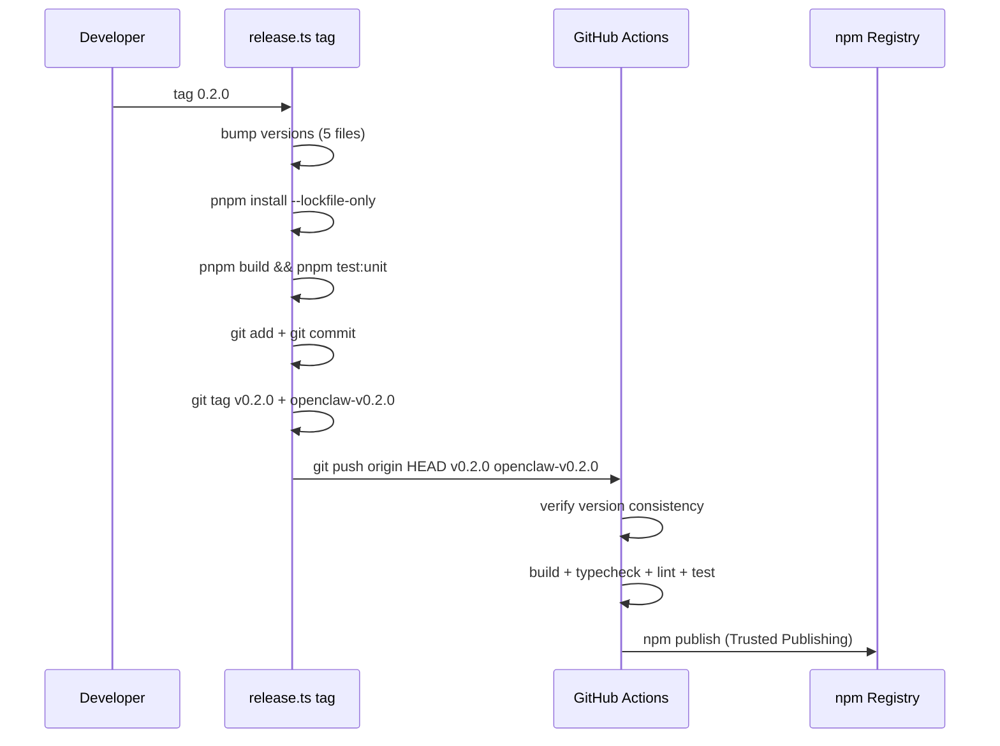

# Release Guide

## Prerequisites

| Tool | Purpose |
|------|---------|
| Node.js 24+ | Runtime |
| pnpm | Package manager |
| npm CLI | Publishing (first release only) |
| GitHub push access | Tag push triggers CI |

## Release Flow

```bash
# Single command — bumps versions, commits, tags, pushes
npx tsx scripts/release.ts tag 0.2.0
```

This runs the full release pipeline:



## Files Bumped

| File | Fields Updated |
|------|---------------|
| `package.json` | `version` |
| `packages/openclaw-plugin/package.json` | `version`, `peerDependencies` |
| `.claude-plugin/plugin.json` | `version` |
| `packages/openclaw-plugin/openclaw.plugin.json` | `version` |
| `pnpm-lock.yaml` | Regenerated |

## Commands Reference

| Command | Description |
|---------|-------------|
| `tag <version>` | Bump + commit + tag + push (normal releases) |
| `tag <version> --dry-run` | Preview without side effects |
| `tag` | Tag only (assumes versions already bumped) |
| `bump <version>` | Bump versions only (no git operations) |
| `preflight` | Check prerequisites (npm login, build, tests) |
| `first-publish` | Manual first publish to npm (one-time) |

All commands: `npx tsx scripts/release.ts <command> [options]`

## First Release (One-Time Setup)

```bash
# 1. Check prerequisites
npx tsx scripts/release.ts preflight

# 2. Publish manually (npm Trusted Publishing not yet configured)
npx tsx scripts/release.ts first-publish

# 3. Configure Trusted Publishing on npmjs.com for each package:
#    Organization: agenticvault
#    Repository:   agentic-vault
#    Workflow:     release.yml (core) / release-openclaw.yml (openclaw)
```

After Trusted Publishing is configured, all subsequent releases use `tag <version>`.

## CI Workflows

| Tag Pattern | Workflow | Package |
|-------------|----------|---------|
| `v*` | `.github/workflows/release.yml` | `@agenticvault/agentic-vault` |
| `openclaw-v*` | `.github/workflows/release-openclaw.yml` | `@agenticvault/agentic-vault-openclaw` |

Both workflows verify that the tag version matches `package.json` before publishing.

## Troubleshooting

| Problem | Cause | Fix |
|---------|-------|-----|
| CI: "Tag version does not match package.json" | Tag pushed without bumping | Delete tag, re-run `tag <version>` |
| "Tags already exist" | Tags from a failed attempt | `git tag -d v0.2.0 openclaw-v0.2.0 && git push origin :refs/tags/v0.2.0 :refs/tags/openclaw-v0.2.0`, then re-run |
| "Working tree is dirty" | Uncommitted changes | Commit or stash, then re-run |
| "Invalid semver" | Version format wrong | Use `X.Y.Z` format (no `v` prefix) |
| npm 403 on publish | Trusted Publishing not configured | See First Release section |
